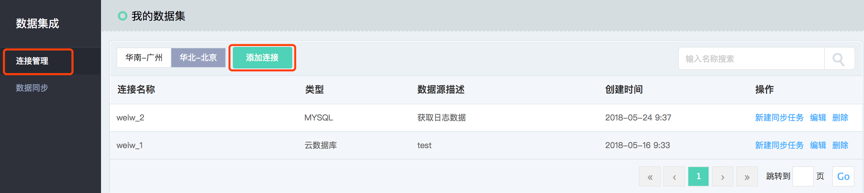
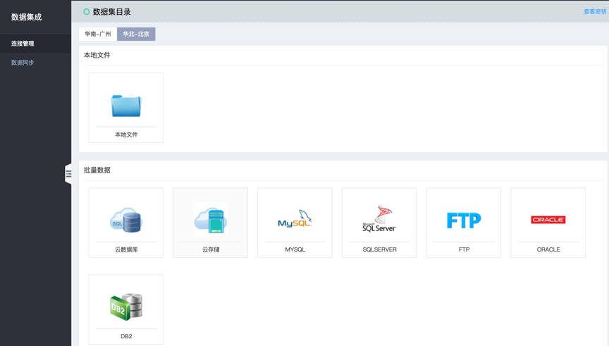
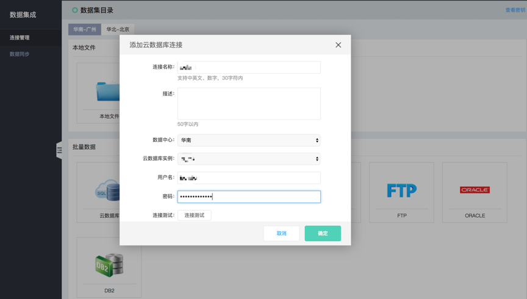

# 创建数据源连接

进入数据集成服务，点击‘连接管理’模块，选择数据集目录。在数据集目录模块，用户可以根据需要选择进行同步的数据集类型。并根据提示完成配置。数据集连接创建成功，是同步任务运行成功的前提。

进入数据集成控制台，选择‘连接管理’：

点击‘添加连接’：

选择数据源端，新建连接。例如创建云数据库RDS连接：

创建完成之后，可以在控制台列表页对源数据集进行维护(添加/管理/修改/删除)·