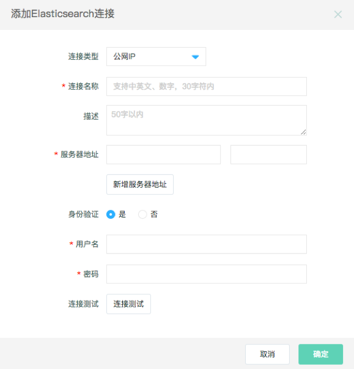

# 配置Elasticsearch数据源

Elasticsearch数据源提供了读取Elasticsearch的能力，您可以配置同步任务。

**操作步骤：**

#### 1. 进入数据工厂，单击‘连接管理’，选择‘添加连接’；

#### 2. 选择数据源类型‘Elasticsearch’；

配置项说明：

* **连接类型**：目前仅支持工网IP版；

* **连接名称**：由中英文、数字、下划线组成，长度不超过30个字符；

* **描述**：对数据源进行简单描述，不得超过50个字符；

* **服务器地址**：填写连接IP和端口；

* **身份验证**：可根据ES服务具体情况选择是/否

* **用户名/密码**：数据库对应的用户名和密码。

#### 3. 单击‘连接测试’；

#### 4. 连接测试通过后，单击‘确定’。
