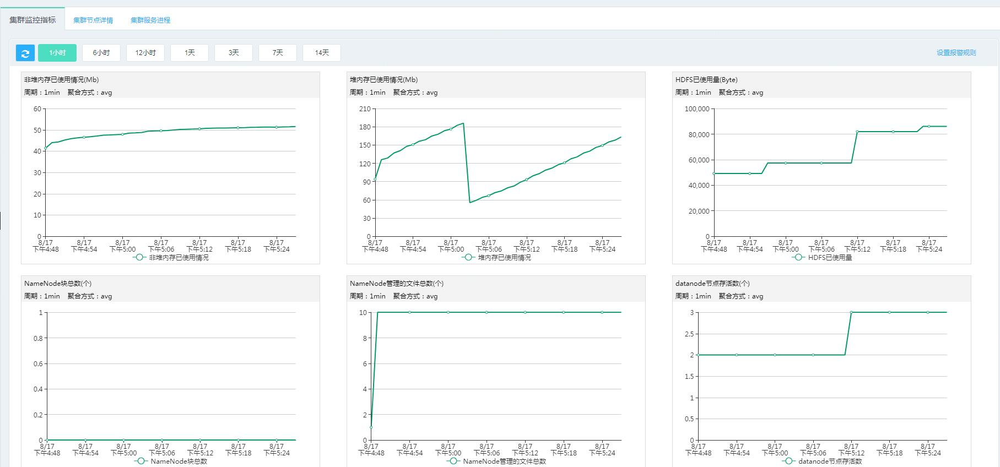
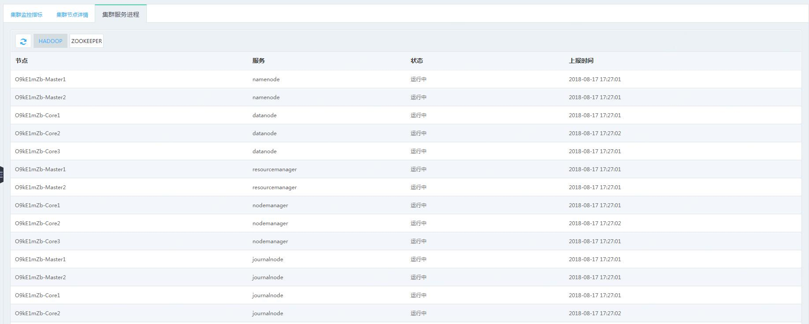

# 集群监控

本文介绍如何配置集群监控。

## 操作步骤
1. 登录 [JMR 控制台](https://xdata.jdcloud.com/rmgr/resources/res-manage/custom-resources.html#/)，选择查看哪个地域下的集群。

2. 选择您想要查看的集群，对应操作中的“监控”。

3. “监控”页面有以下三部分监控内容：
 - 集群监控指标（共10项监控指标，包含hadoop和yarn）
 
 
 - 集群节点详情（集群是由多台云主机实例构成，实例指云主机。用户可在“管理-云监控-云主机”中，通过搜索主机名称，即可查看到实例的监控状态。也可在如下页面，点击云主机名称再跳转到云主机监控。）
 
 
 - 集群服务进程（展示应用层节点的服务状态）
 
 
 

	   

