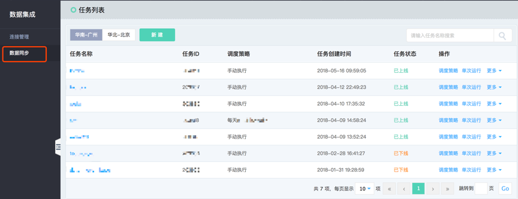
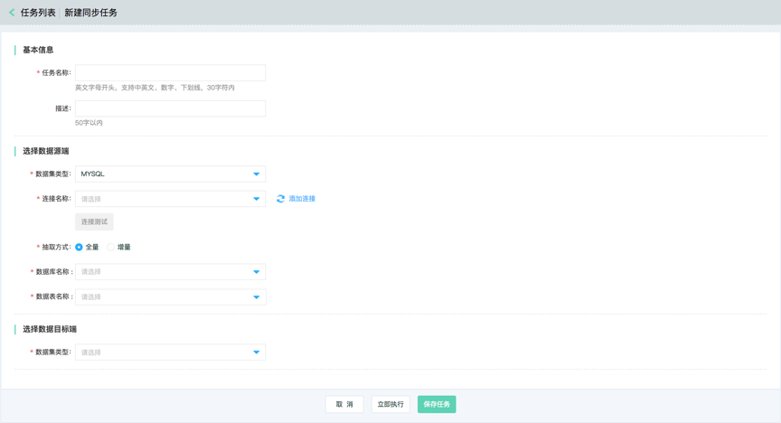

# 创建同步任务

进入数据集成的‘数据同步’任务列表：

点击‘新建’可创建新的同步任务：

输入该同步任务的名称和描述，以方便后期对同步任务的识别、监控和管理。

配置数据源端和目标端。选择数据源端作为同步任务的输出端，选择数据目标端作为同步任务的输入端。同步任务将从数据源端获取数据，并按照用户配置的规则将数据写入数据目标端。

点击‘立即运行’，则当前同步任务已被保存且执行。可以在任务列表和运行历史中，查看相应生成的同步任务实例和运行实例。如当前只需保存该同步任务，无需保存，则点击保存后返回任务列表。

对需要修改、上/下线的同步任务，依旧是在该模块进行操作。