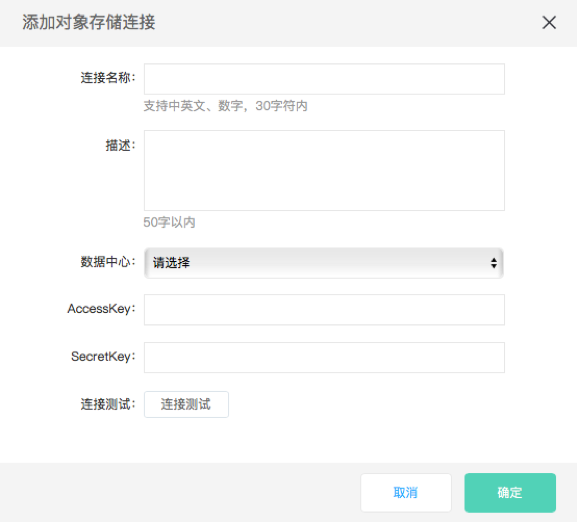

# 配置对象存储数据源

对象存储(Objective Storage Service，简称OSS)是京东云为用户提供安全、稳定、海量、便捷的对象存储服务

操作步骤：

1.        进入数据工厂，单击‘连接管理’，选择‘添加连接’；

2.        选择数据源类型‘对象存储’

​    配置项说明：

​    **连接名称**：由中英文、数字、下划线组成，长度不超过30个字符；

​    **描述**：对数据源进行简单描述，不得超过50个字符；

​    **数据中心**：选择地域，当前支持‘华北’、‘华南’；

​    **AccessKey/SecretKey**：在Access Key管理中查看；

3.        单击‘连接测试’；

4.        连接测试通过后，单击‘确定’。