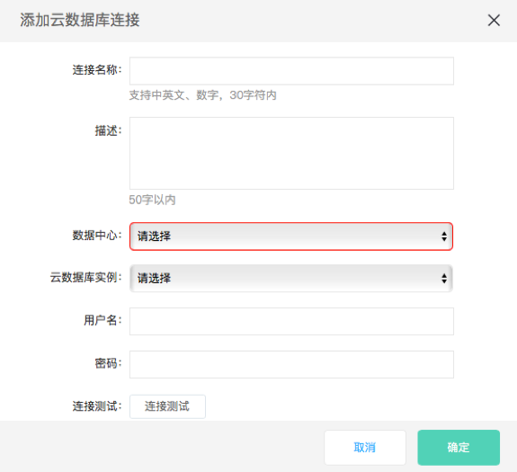

# 配置云数据库数据源

云数据库数据源提供了读取RDS的能力，可以配置同步任务。

操作步骤：

1.        进入数据工厂，单击‘连接管理’，选择‘添加连接’；

2.        选择数据源类型‘云数据库’；

配置项说明：

​    **连接名称**：由中英文、数字、下划线组成，长度不超过30个字符；

​    **描述**：对数据源进行简单描述，不得超过50个字符；

​    **数据中心**：选择地域，当前支持‘华北’、‘华南’；

​    **云数据库实例**：选择数据库实例名称；

​    **用户名/****密码**：数据库对应的用户名和密码。

3.        单击‘连接测试’；

4.        连接测试通过后，单击‘确定’。