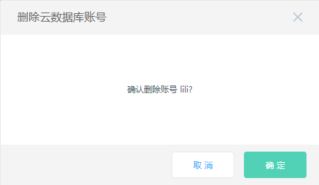

# 删除账号
根据您的业务变化，您可以手动删除数据库账号，可以通过控制台进行相关操作。 

## 操作步骤
1.  登录 [区块链数据服务控制台](https://bds-console.jdcloud.com/block/list)。   
2.  选择需要删除账号密码的目标实例，点击目标实例，进入实例详情页 。  
3.  点击 **账号管理** Tab 页， 选择目标账号，在操作中点击 **删除** ，弹窗如下图所示。  
    * 点击 **确认** 按钮，完成删除账号操作。
    * 点击 **取消** 按钮，放弃删除账号操作。
    

4. 点击 **确定** 按钮 ，完成账号删除。

