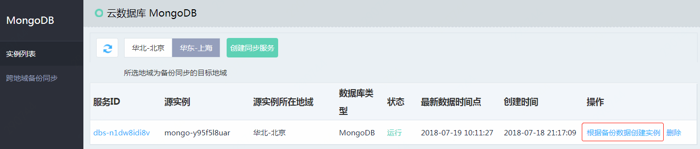
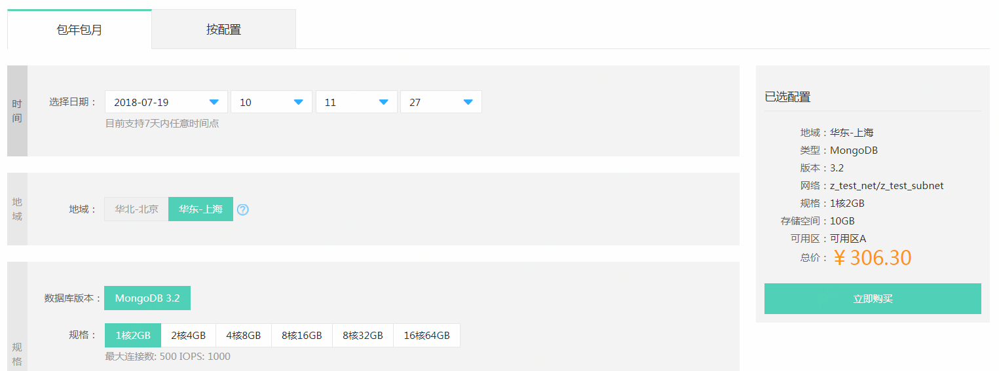

# 根据备份数据创建实例

基于跨地域备份服务同步的全量备份与增量备份，您可以选择7天内的任意时间点，快速创建出新的 MongoDB 实例。

## 注意事项
- 新实例的存储空间不应小于源实例，否则可能创建失败。
- 创建完成时间与源实例的数据量大小有关，通常在几分钟至数小时内完成。

## 操作步骤
1. 登录 [MongoDB 控制台](https://mongodb-console.jdcloud.com/mongodb)。
1. 进入“跨地域备份同步服务”页，选择目标服务，点击 **根据备份数据创建实例**，打开“创建实例”页面。

   

1. 在创建页选择数据时间点及实例配置等信息。

   

   - 地域：当前备份数据所在地域，即备份同步服务设置的目标地域，不可修改。
   - 时间：选择备份数据的时间点，支持选择7天内的任意时间。
   - 存储空间：应不小于源实例，否可可能创建失败。
   - 其他配置信息同[创建实例](../../Getting-Started/Create-Instance.md)。

1. 点击 **立即购买** ，进入“订单确认”页面。
1. 在“订单确认”页面，确认实例信息，并阅读《云数据库 MongoDB 服务条款》。
	- 如计费类型为按配置，请点击 **立即开通** 。
	- 如计费类型为包年包月，请点击 **立即支付** ，进入“订单支付”页面，完成支付流程。
1. 支付流程流程完成后，页面会自动跳转到 MongoDB “实例列表”页面，等待实例创建完成，您可以在“实例列表”页面查看新创建的实例。

# 相关参考
- [创建跨地域备份同步服务](Create-Backup-Sync.md)
