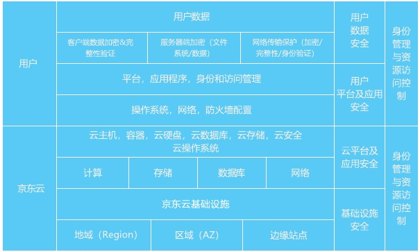

# 安全责任共担

安全性与合规性是京东云和用户共同的责任。京东云负责云平台自身的安全，用户负责云平台上的业务安全。

## 1. 京东云安全责任

京东云负责基础设施、物理设备资源、云操作系统及云服务产品的安全控制和管理，并基于安全合规、高可用最佳实践、安全的云产品及安全服务，构建基础设施、平台及应用和身份管理与资源访问控制的多维立体安全防护体系，并保障其运维运营安全。

## 2. 云用户安全责任

云用户基于京东云提供的服务构建云端应用系统，并运用京东云安全的云产品和安全服务以及安全生态第三方安全产品保护自己的业务系统。云用户负责对在云平台上使用的网络、系统、应用、管理、数据、安全等服务的定制配置、自行部署及运维运营。云用户负责安全的使用云平台，确保业务的安全设计、数据保护、认证加密等必要的安全措施和功能实现，管理好账号密码和人员授权，安全的开发应用、运营业务。
