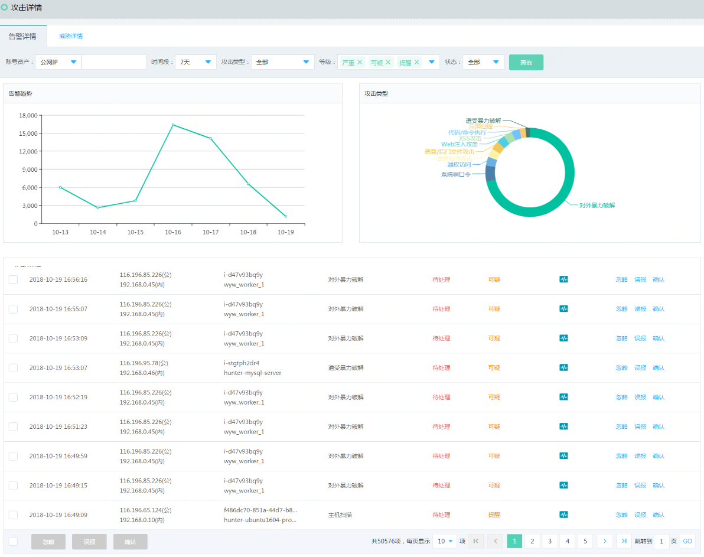
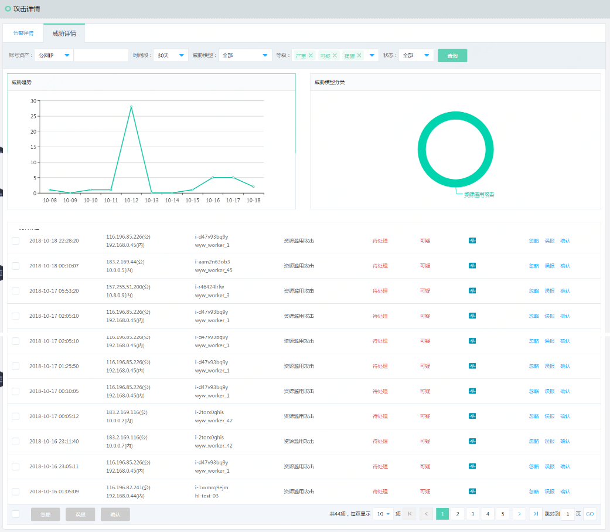

# 攻击详情

### 告警事件

#### 界面

#### 功能说明
提供基于账号资产、详情时间段、攻击类型、等级和处理状态的查询，事件详情列表，以及事件处理状态更细。同时提供具体事件详情和修复建议。

- 操作步骤
短信接收【京东云】您账号***\***@[jdcloud.com](https://jdcloud.com/)下的云上资产：*.win2012-bj，发现告警事件：遭受DDoS攻击，请登录京东云-态势感知进行应急响应。

 - 快速查询
通过账号资产、详情时间段、攻击类型 快速查询到自己关心的告警事件。通过攻击趋势，可以方便的查看到近期同类事件趋势。
点击 【告警详情】->【操作】-> 【详情与建议】，页面跳转到具体攻击类型的详情页。查看攻击事件的详细情况，给出防护建议。其中包含临时解决方案或者云安全产品建议。
如果用户觉得临时解决方案能解决问题，那么开始操作。如果用户觉得产品解决方案能起作用，就点击购买。或者用户觉得帮助都不大就返回。

  - 事件处理
如果用户根据反馈的事件详情做出判断，如果是误报，忽略或者确认其事件判断，请点击相应的按钮。如果用户对某条事件特别关注，可以通过工单的形式反馈，由京东云后端运维人员分析原因，做出解答。
备注：被打成【忽略】标签的事件 不会在用户控制台再次显示。被打成【误报】标签的事件，还会在控制台显示。有时候，用户会对历史事件进行查询，也可以通过等级和状态过滤。等级分为：紧急和常规。

### 威胁分析

#### 界面

  

#### 功能说明
提供基于账号资产、详情时间段、威胁模型、等级和处理状态的查询，事件详情列表，以及事件处理状态更细。同时提供具体事件详情。

- 操作步骤
短信接收【京东云】您账号***\***@[jdcloud.com](https://jdcloud.com/)下的云上资产：[*.win2012-bj](https://login.xxx.com/)，发现Web针对性攻击威胁，请登录京东云-态势感知进行应急响应。

 - 快速查询
通过账号资产、详情时间段、攻击类型 快速查询到自己关心的告警事件。通过攻击趋势，可以方便的查看到近期同类事件趋势。
点击 【威胁详情】->【操作】-> 【详情】，页面跳转到【威胁模型的详情页】。查看针对性攻击事件的详细情况。
点击各个阶段的攻击事件跳转到告警事件详情页。
点击返回键，回到【威胁详情】页。

- 事件处理
如果用户根据反馈的事件详情做出判断，如果是误报，忽略或者确认其事件判断，请点击相应的按钮。如果用户对某条事件特别关注，可以通过工单的形式反馈，由京东云后端运维人员分析原因，做出解答。
        - 备注：被打成【忽略】标签的事件 不会在用户控制台再次显示。被打成【误报】标签的事件，还会在控制台显示。有时候，用户会对历史事件进行查询，也可以通过等级和状态过滤。等级分为：严重、可疑和提醒。
