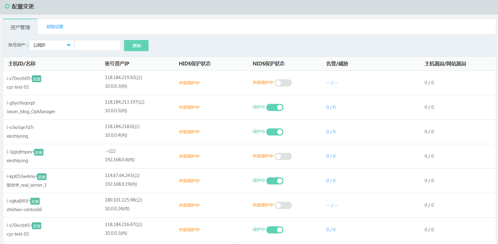
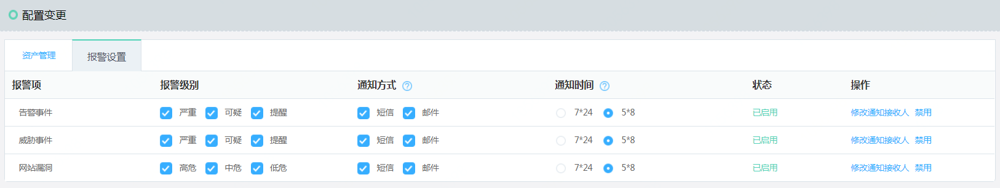

# 配置变更

### 资产管理

#### 界面 

#### 功能说明
本期由于引入主机相关的威胁事件，态势感知资产的概念也扩充到外网IP和内网IP的组合。提供基于内外网IP查询。以及网络检测引擎开放和关闭功能。

#### 操作步骤
提供基于公网IP、内网IP、主机ID、主机名称、企业版和基础版的查询，同时关联告警、威胁、主机漏洞和网站漏洞的数量。
关闭单个公网IP的网络检测引擎，点击“网络引擎操作”对应的公网IP。
批量关闭公网IP的网络检测引擎，可以使用云态势感知提供的OpenAPI功能关闭
所报移动到账号资产IP，可以查询主机安全软件安装状态，同时可以点击“去安装”跳转到主机安全客户端安全页面。

### 事件报警
#### 界面

#### 功能说明
为了让用户快速获取威胁事件告警，通过邮件、短信报警的方式通知用户。

#### 操作步骤
【配置变更】->【报警设置】，可以对告警事件、威胁事件和网站漏洞报警级别、通知方式、通知时间、通知人设置。告警设置发送规则：为提升用户体验，短信通知：单台云主机一天最多1条；单个账号一天最多5条。邮件通知：单个账号每天最多20封
