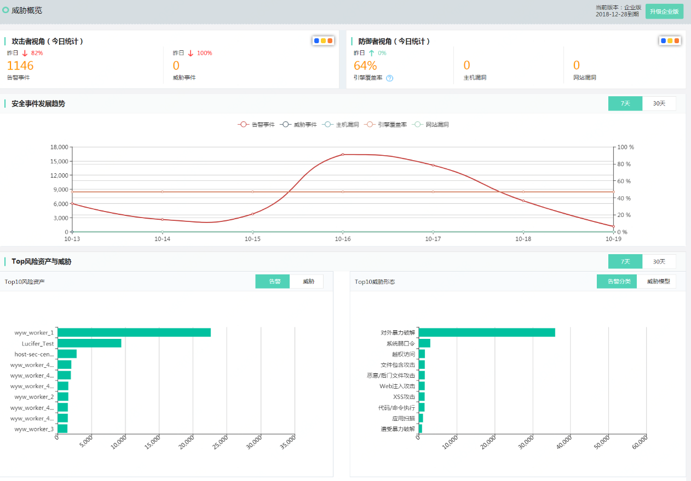

# 威胁概览

### 界面

  

### 名词解释

#### 告警事件
包含网络入侵检测、DDoS基础防护检测和主机安全检测发现的告警事件，新增威胁情报、动态行为分析、机器学习发现的高价值告警事件。

#### 威胁事件
通过京东云提供的基于安全威胁模型大数据关联的新型攻击事件，包含实时分析事件、离线分析事件。

#### 引擎覆盖率
由网络入侵检测引擎、DDoS基础防护检测引擎和主机安全检测引擎启动覆盖率组成，网络入侵检测引擎启动覆盖率=已开启NIDS监控的公网IP数量/当前用户下所有公网IP数量，主机安全检测引擎启动覆盖率=已安装主机安全软件云服务器数量/当前用户下所有云服务器数量，DDoS基础防护启动覆盖率默认为100%，用户无法手工调整。权重为1：1：1，引擎开启监控的覆盖率越高，其捕捉安全事件的能力越强，故使用安全引擎覆盖率量化衡量其开启率。最佳实践为100%

#### 弱点事件
##### 主机漏洞
站在防御者的视角自查云主机上的漏洞情况。每个漏洞称之为一个主机弱点事件。
##### 网站漏洞
根据用户资产配置对主机和网站进行定期漏洞扫描，帮助用户检查网站的健康状态，包括：高危端口对外开放、信息泄露检测、弱口令、web通用漏洞、web专用漏洞。

### 功能说明
提供租户业务安全状态量化指标，以攻击者视角的告警事件、威胁事件，以防御者视角的引擎覆盖率、主机漏洞事件、网站漏洞事件指标与变化。同时提供安全事件7/30天发展趋势，以告警、威胁事件聚合统计的Top10风险资产，以告警分类、威胁模型聚合统计的Top10威胁形态 。

同时提供升级企业版入口。

### 操作步骤
默认进入威胁概览页面，单击攻击者视角的告警事件的数字跳转到【告警事件详情】页面。单击攻击者视角的威胁事件的数字跳转到【威胁事件详情】页面，单击防御者视角引擎覆盖率跳转到【配置变更】->【资产管理】，单击防御者视角主机跳转到【弱点事件】->【主机漏洞】，单击防御者视角主机跳转到【弱点事件】->【网络漏洞】。
  - 【攻击事件发展趋势】点击7天或者30天提供，7天或者30天内的告警事件、威胁事件、引擎覆盖率、主机事件、网站漏洞数量趋势，右侧坐标显示百分比，针对安全引擎启动覆盖率显示。鼠标移动到每天后会显示告警事件、威胁事件、引擎覆盖率、主机事件、网站漏洞数量。 
  - 点击Top10某个被攻击资产，系统会携带对应的资产IP过滤条件跳转到【告警事件详情】页面。统计时长为7天或者30天根据其实选定的时间状态。 
  - 点击Top10某个威胁分类，系统会携带对应的威胁分类过滤条件跳转到【告警事件详情】页面。统计时长为7天或者30天根据其实选定的时间状态。 
