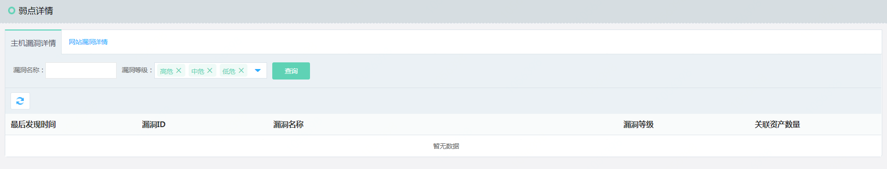
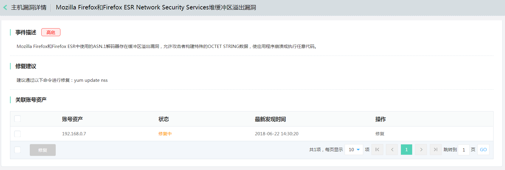

# 弱点详情

### 主机漏洞事件

#### 界面

  
  

#### 功能说明
目前提供基于主机漏洞详情，以漏洞为统计维度想用户展示主机弱点。督促用户修复相关漏洞。

- 操作步骤
点击漏洞名称跳转到【漏洞详情页】以及关联的账号资产。
点击多选框，可以批量修复。
Windows系统可以点击修复操作，Linux给出修复建议，用户自行修复。

### 网站漏洞事件

#### 界面

  
  

#### 功能说明
根据用户资产配置对主机和网站进行定期漏洞扫描，帮助用户检查网站的健康状态。

- 操作步骤
点击漏洞名称跳转到【漏洞详情页】以及关联的账号资产。
点击多选框，可以批量修复。
