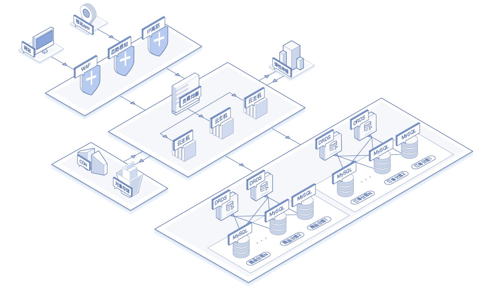
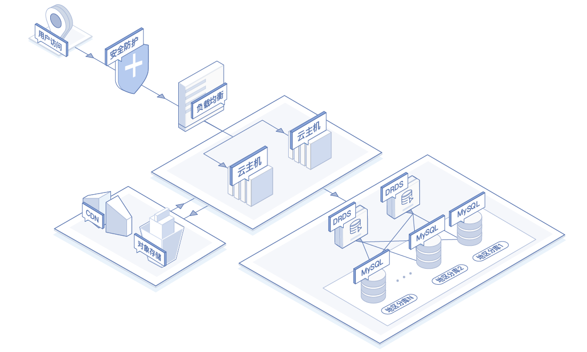

# 应用场景

## 电商、O2O在线交易
适合电商、O2O的大规模在线交易场景，可以将用户、订单，商品、物流等数据进行分库分表，支持高并发，海量的交易，并能够容易的进行数据库的水平扩展，提高整个系统的并发能力、处理能力和存储能力。

## 海量数据的分片查询、分析
强大的分库分表能力天然支持数据的自动分片，可将数据按既定的分片策略存储到后端的MySQL节点，并可随时按需进行扩展，适合海量数据的分片查询，分析，例如按时间查询历史信息，按照地区汇总各种数据等。

