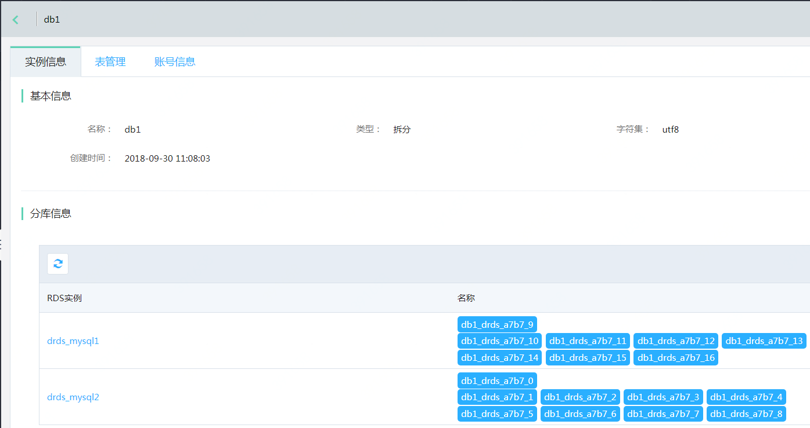

# 查看数据库

**1. 进入【库管理】页面**

点击实例名，进入实例页面，选择 **【库管理】** 页面，可看到当前实例下的所有数据库，点击数据库名称，进入数据库详情页面

**2. 基本信息**

库信息页面中会列出数据库的基本信息，例如数据库名，字符集，创建时间等，以及列出当前数据库对应到后端MySQL实例的实例名以及上面各个实际的数据库

**3. 表管理**

列出了当前数据库中，定义了需要分表的表名，具体相关操作可参考 **【表管理】** 相关文档

**4. 账号管理**

列出了对当前数据库有访问权限的账号，并可在此修改账号权限

