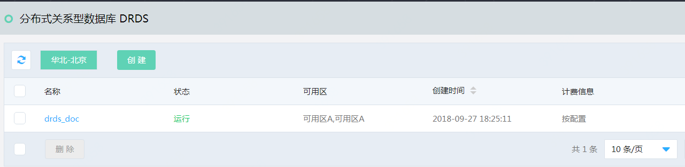
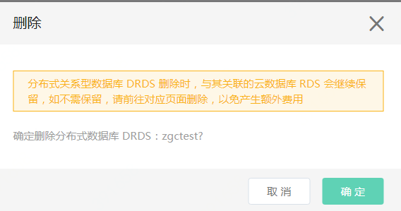

# 删除实例

**注意：删除实例必须首先删除DRDS上的数据库，否则不允许执行实例删除操作。删除数据库的操作可以查看文档“[删除数据库](../Database/Delete-Database.md "删除数据库")”**

**1. 进入实例列表页**
当前页面会显示当前区域下的各个DRDS实例的概要信息。点击最右边的 **【删除】** 链接

**2. 确认删除**

点击 **【确认】** 进行删除

