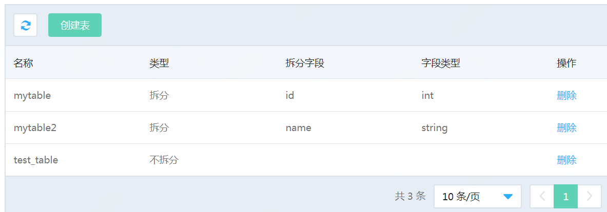

# 删除表

**删除表有两个步骤(与创建表的顺序相反）**

1）登录到DRDS中执行DROP语句

2）登录控制台，在【表管理】中，删除DRDS实例中表的路由信息

**注意：上述两个操作的顺序必须严格按照先登录DRDS执行DROP语句；再登录控制台删除的顺序**

**1. 连接DRDS，执行DROP语句**

通过客户端工具，登录到DRDS中（不是MySQL），连接相应的数据库并执行DROP语句，DRDS会根据保存的表的路由信息，自动删除后端MySQL数据库中的实际的数据表。

**2. 进入【库管理】->【表管理】页面**

点击实例名，进入实例页面，选择【库管理】页面下的【表管理】，点击右边的“**删除”**连接

**3. 确认删除**

在对话框中点击 **【确认】** 确认删除
