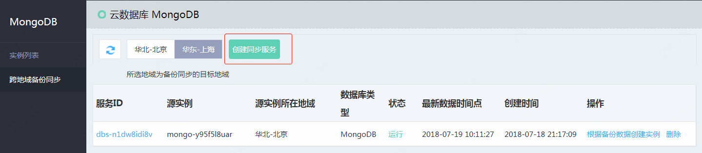
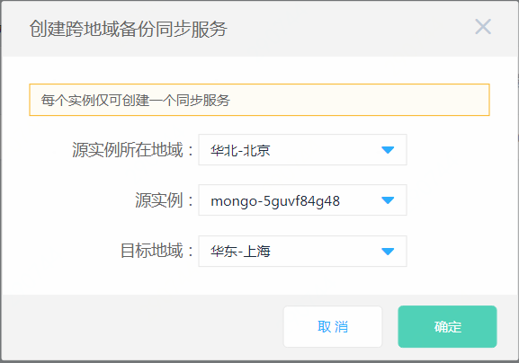

# 创建跨地域备份同步服务

跨地域备份同步服务是京东云提供的跨地域数据同步方案，该服务可将实例的全量备份与增量备份同步到您指定的地域，并支持基于备份数据快速创建新的数据库实例。通过该服务，您可以轻松实现数据异地灾备。

本文介绍如何通过控制台创建地域备份同步服务。

## 注意事项

- 一个实例仅可创建一个跨地域备份同步服务。
- 目标地域的备份数据保留7天，您可选择7天内的数据时间点创建新实例。
- 如果源实例删除，则其对应的跨地域备份同步服务将一并删除。
- 跨地域备份同步服务删除后，目标地域同步的备份也将会删除。

## 前提条件

- 实例状态为“运行”，且计费状态正常。

## 操作步骤

1. 登录 [MongoDB 控制台](https://mongodb-console.jdcloud.com/mongodb)。
1. 进入“跨地域备份同步服务”页，点击按钮 **创建同步服务** ，打开“创建弹窗”。

    

1. 在“创建弹窗”中填写服务信息。

    

    - 源实例所在地域：选择实例所在的地域。
    - 源实例ID：选择要创建备份同步服务的实例，当前已存在备份同步服务的实例将不在此展示。
    - 目标地域：选择要将备份文件同步到哪个地域，目标地域不可与源实例所在地域相同。

1. 确认填写信息无误，点击 **确定**，创建同步服务。
2. 同步服务创建完成后，您可在“跨地域备份同步服务”页面查看当前服务的“状态”与“最新数据时间点”。

## 相关参考

- [根据备份数据创建实例](Create-Instance-by-Backup-Sync.md)
