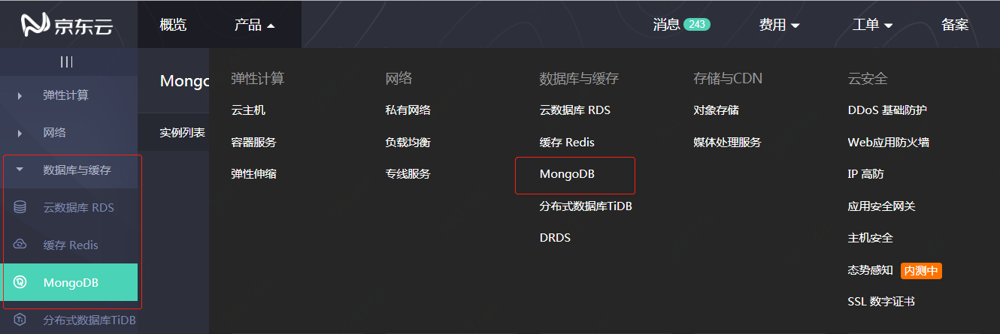
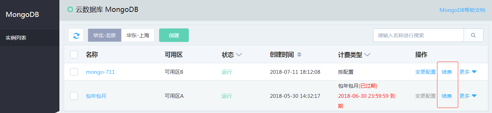
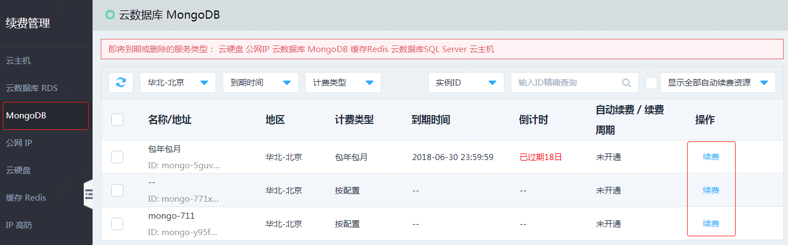

# 续费流程

本文介绍 MongoDB 实例的续费入口。

## 入口1：[MongoDB 控制台](https://mongodb-console.jdcloud.com/mongodb)
1. 进入[京东云控制台]()。
2. 通过页头导航，依次点击 **产品** >  **MongoDB**,打开“实例列表”页面；也可以通过左侧菜单，依次点击 **数据库与缓存** > **MongoDB**,打开“实例列表”页面。

    

3. 在操作项中点击 **续费**，进入“续费页面”，续费步骤请参见“[续费实例](../Operation-Guide/Instance-Management/Renewal-Instructions.md)”

    

## 入口2：[续费管理控制台](https://renewal-console.jdcloud.com/renew/mongodb)
1. 进入京东云控制台。
2. 通过页头导航，依次点击 **产品** > **续费管理**,打开“续费管理”页面；也可以通过左侧菜单，依次点击 **管理** > **续费管理**,打开“续费管理”页面。

    

3. 在“续费管理”页面，点击 ** MongoDB**，查看 MongoDB 实例。
4. 在操作项中点击 **续费**，进入“续费页面”，续费步骤请参见“[续费实例](../Operation-Guide/Instance-Management/Renewal-Instructions.md)”

    
