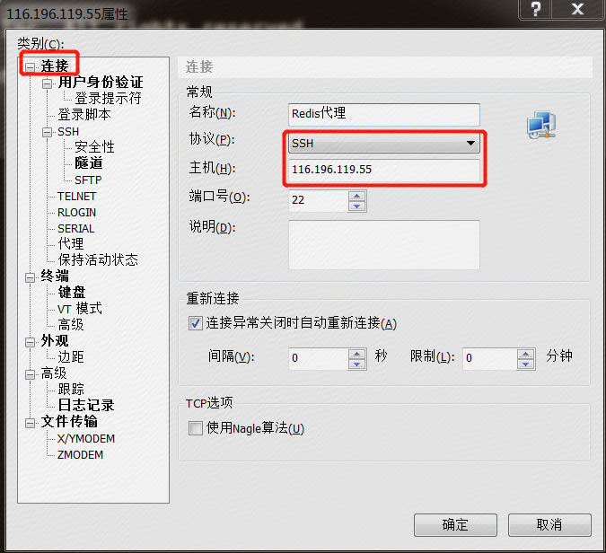
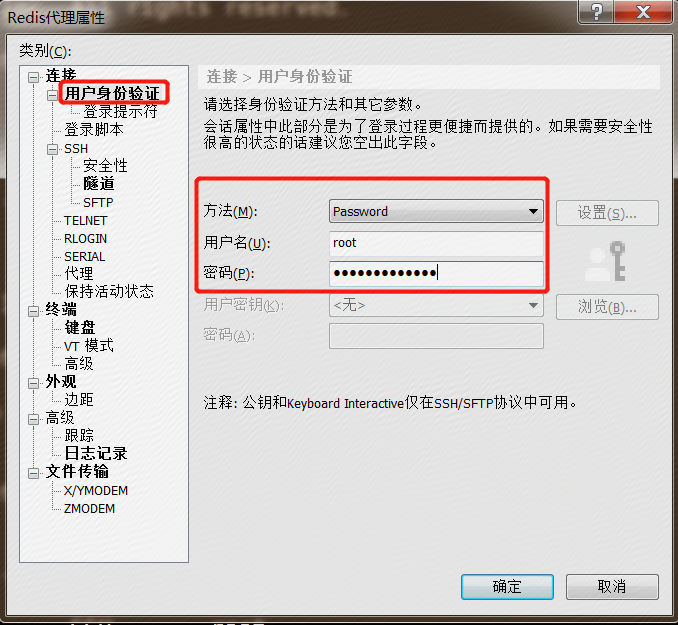
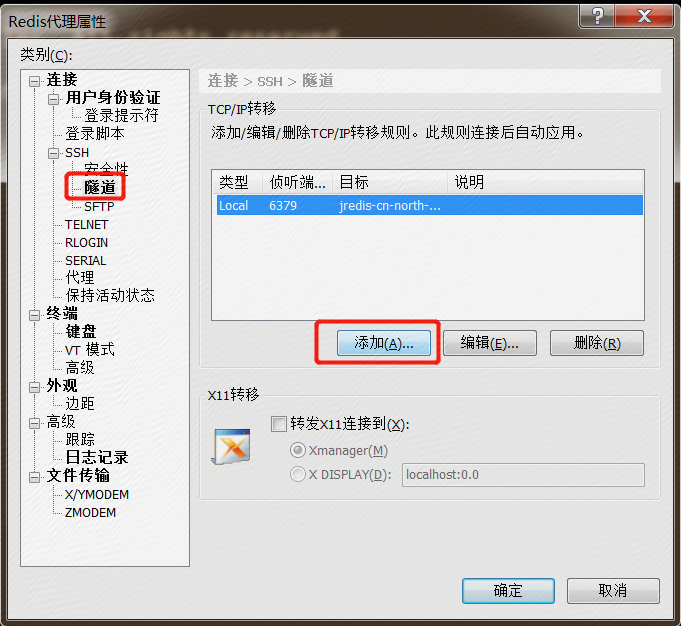
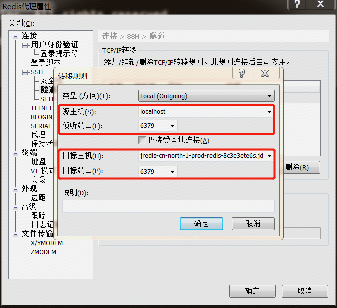
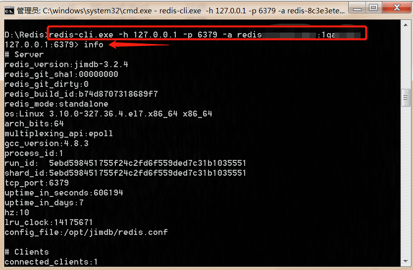

# 公网连接Redis实例

如果需要本地电脑连接京东云缓存Redis，您可以借助 SSH 的端口转发功能实现，以下以 Xshell 为例，说明设置方式。

前提条件：一台 Linux 系统的京东云主机，绑定公网 IP，并与京东云缓存Redis在同一私有网络。

## 操作步骤

1、本地电脑安装 Xshell，以 SSH 协议远程连接到有公网IP的云主机。

- 选择“连接”，输入名称、选择协议为 SSH；

- 主机IP：填写京东云主机的公网 IP。

2、用户身份登录

- 方法：Password；

- 用户名：填写京东云主机的登录用户名，默认为“root“；

- 密码：登录京东云主机密码。

3、设置端口转发规则。

- 选择“SSH”下的“隧道”，点击“添加”。

4、填写转移规则信息

- 源主机：填 localhost 或127.0.0.1；

- 监听端口：填写Xshell设置端口转发时候本地监听端口；

- 目标主机：填写缓存Redis的域名，详见 京东云缓存Redis控制台 ，点击实例名称进入实例详情页，资源信息 –>访问域名；

- 目标端口：填写缓存Redis的端口，详见 京东云缓存Redis控制台 ，点击实例名称进入实例详情页，资源信息–>端口，一般默认为6379。

5、连接测试（window端）

