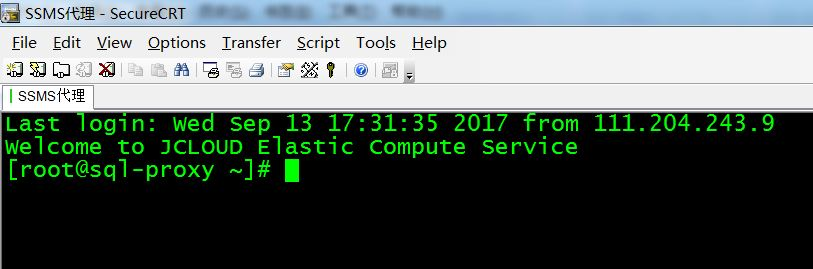
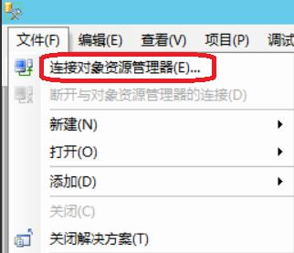
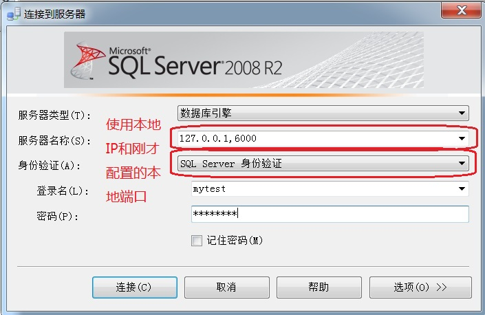

# 客户端连接SQL Server实例

## 微软客户端下载地址
首先下载SQL Server Management Studio（以下简称SSMS），官方地址： 
http://download.microsoft.com/download/0/9/9/099E0C83-072B-42A5-83A0-9BB3D2E6E2A3/SQLManagementStudio_x64_CHS.exe

## 不开启外网访问的连接方法
为了数据库的安全性，在生产环境中不建议开启外网访问功能。 如果用户临时需要在本地通过客户端访问数据库实例，可以借助SSH2的端口转发功能实现从本地直接连接云上的SQL Server数据库，具体步骤如下：（以SecureCRT为例）

1. 准备一台具有公网IP的云主机，操作系统为Linux，例如Centos 7.3 64位版。该主机跟云数据在同一个VPC和子网中
2. 在SecureCRT中连接协议选择“SSH2”，并配置公网云主机的IP

3. 选择“Port Forwarding”，并点击“Add”

4. 配置转发参数

5. 使用SecureCRT连接公网云主机

6. 本地运行SSMS，连接数据库

7. 输入连接信息
在服务器名称一栏中输入本地IP “127.0.0.1” 和刚才配置的本地端口 6000，中间用逗号分隔；

身份验证选择“SQL Server 身份验证”

8. 成功后，即可连接数据库进行操作

