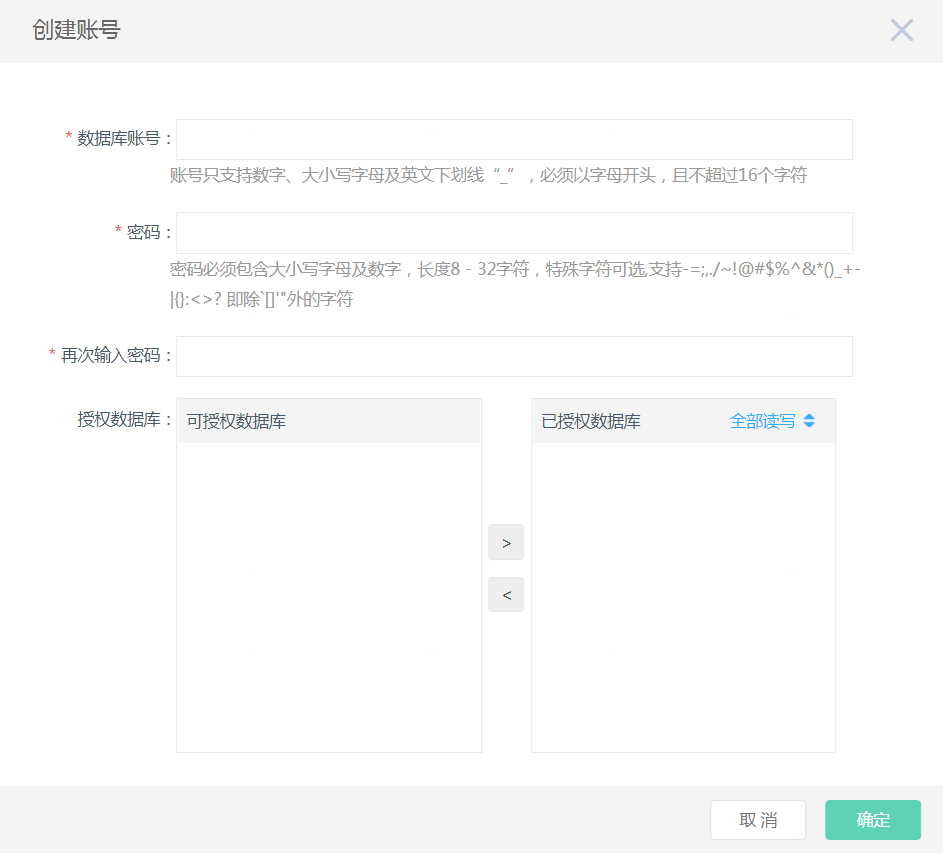

# 创建账号

## 1. 操作入口
进入实例列表页，点击实例名，进入实例页面，选择【账号管理】页面，点击【创建账号】

## 2. 输入账号相关信息
- 输入“数据库账号”，“密码”，并选择需要授权的数据库，进行授权，完成后点击【确认】
- 账号名称及密码的规则在控制台上有提示，也可参考文档 名称及密码限制
- 第一次创建账号时，如果还没有创建数据库，可以暂时先不对数据库授权，授权步骤可以在后续的“创建数据库”中完成。

