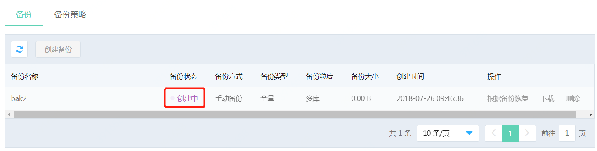

# 创建备份

## 1. 操作入口
点击实例名，进入实例页面，选择【备份管理】页面，点击【创建备份】，并输入备份名称

## 2.选择备份粒度
选择备份粒度
- 实例备份：表示备份整个实例；
- 多库备份：表示以数据库为单位，选择多个数据库进行备份。

如果选择“实例备份”，选择后点击“确认”开始备份。

 如果选择“多库备份”  ，会列出当前可选择的数据库（只有处于"运行"状态的数据库才会显示在列表中）。选择要备份的数据库，并点击确认开始备份。

## 3. 备份完成
返回备份列表页能看到备份显示“创建中”
等待一段时间后，点击刷新按钮，手工刷新页面，可以看到备份完成，显示备份“正常”

