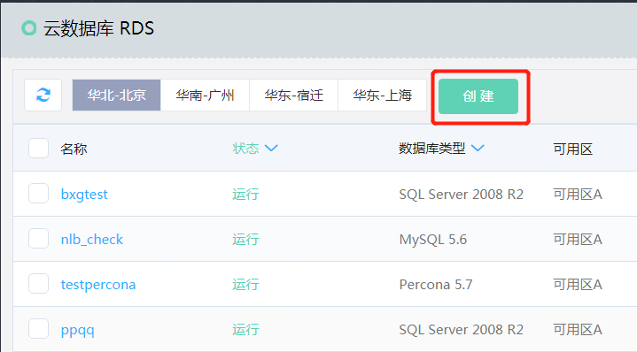
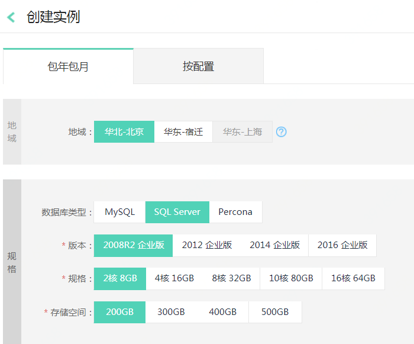
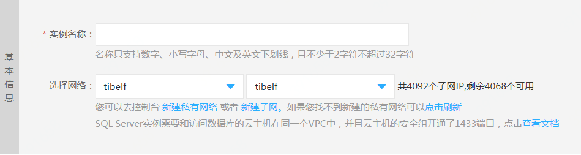
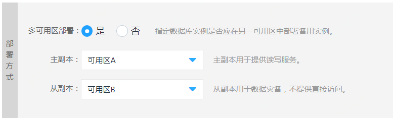
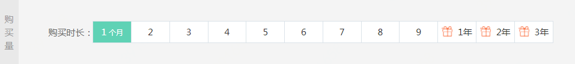
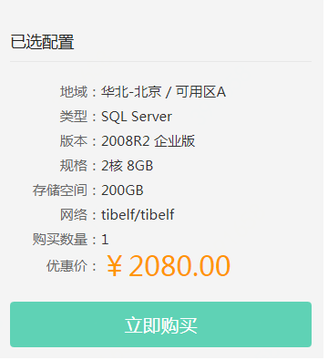
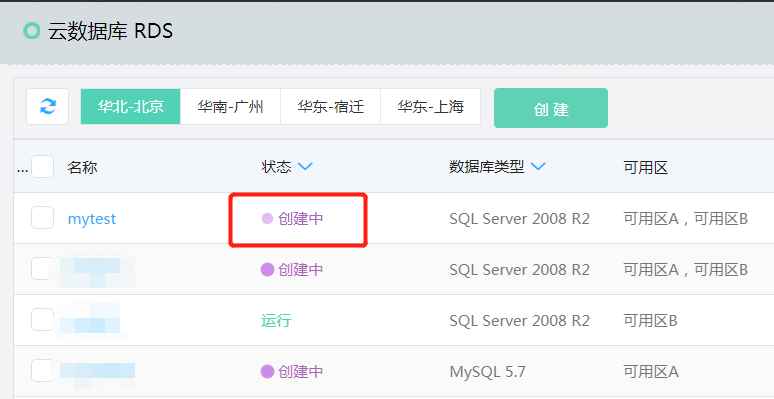

# 创建实例
可以通过控制台快速创建云数据库实例

## 前提条件
- 已经开通云数据库 RDS 权限
- 如果创建计费方式为按配置的资源，请确保账户余额（或代金券金额）不少于 50 元

## 1. 操作入口
- 进入RDS实例列表页，可以看到当前区域下的各个云数据库实例的概要信息，包括计费信息和过期时间等。
- 点击【创建】按钮，新建一个实例。

   
## 2. 选择实例配置等信息
选择或输入实例的相关配置信息，实例配置的参数说明如下：

- 计费方式：可选择“包年包月”或“按配置”计费，关于计费方式的选择，请参考[计费规则](../../Billing-Rules.md)。
- 地域：选择实例所在的地域，**不同地域资源的内网不互通，创建后不能更改**。关于地域的详细说明，请参考 地域与可用区。建议用户选择最靠近您用户的地域，可降低访问时延、提高下载速度。
- 数据库类型：目前支持 MySQL，SQL Server，Percona, MariaDB 三种数据库类型，不同地域支持的数据库类型不同，具体以控制台为准。
- 版本：指的是数据库类型的版本，不同地域支持的版本不同，具体以控制台为准。
- 规格：实例的CPU和内存，不同的规格对应不同的最大连接数和最大IOPS；关于规格的详细说明，请参考 价格总览。
- 存储空间：该存储空间包括数据空间、系统文件空间以及日志文件空间。

- 私有网络：只支持在私有网络中创建。如果用户没有私有网络及子网，可以通过【新建私有网络】和【新建子网】的链接创建私有网络和子网。创建完成后，点击【刷新】，就可以看到新创建的私有网络和子网了。
   - 在选择私有网络的时候，请确保需要连接数据库实例的云主机和数据库实例在同一个私有网络内。
   - 由于管理的需要，选择的子网保留若干剩余IP才允许创建实例。
      - MySQL, Percona, MariaDB：需要4个以上的剩余IP
      - SQL Server：需要10个以上的剩余IP
      

 
- 部署方式：目前支持单可用区部署，多可用区部署两种部署方式。
   - 多可用区部署：数据库主从分别位于不同的可用区，可用性更高：一个可用区发生故障，整个实例仍然可提供服务。
   - 单可用区部署：主从位于同一可用区，如果该可用区发生故障，整个实例无法对外提供服务。
   
  

- 基本信息
   - 实例名称：允许重复，名称的长度和字符有一定限制，具体以控制台为准。
   - 库名称：实例创建成功后，相应也会在实例中创建你指定的数据库，名称为您这里指定的库名；库名我们保留了一些关键字名称，请参考 Q&A，并且库名的长度和字符有一定限制，具体以控制台为准。
   - 数据库账号，密码：实例创建成功后，你就可以用此账号，密码登录数据库实例；账号我们保留了一些关键字名称，请参考 Q&A，并且账号，密码的长度和字符有一定限制，具体以控制台为准。

- 购买时长：如计费方式选择包年包月则需选择购买时长，可选择1个月至2年；购买的时长越长，折扣力度越大，具体以控制台为准。

## 3. 确认购买
信息输入完成后，可查看点击页面右边的价格信息，并点击【立即购买】

## 4. 支付订单
然后进入订单确认页面，确认购买信息无误后，点击【立即支付】

## 5. 实例创建中
- 支付成功后自动返回实例列表页面，能看到实例状态为"创建中"
- 然后进入订单确认页面，确认购买信息无误后，点击【立即支付】

## 6. 创建完成
稍等一会后，点击刷新按钮，手工刷新页面，显示实例创建完成，正常“运行”中

