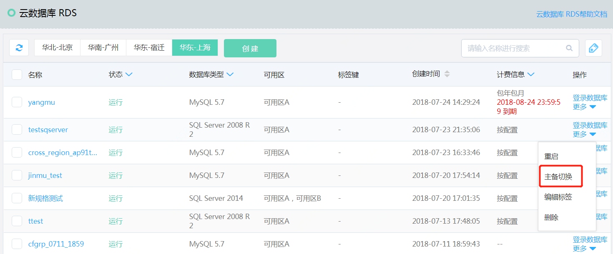
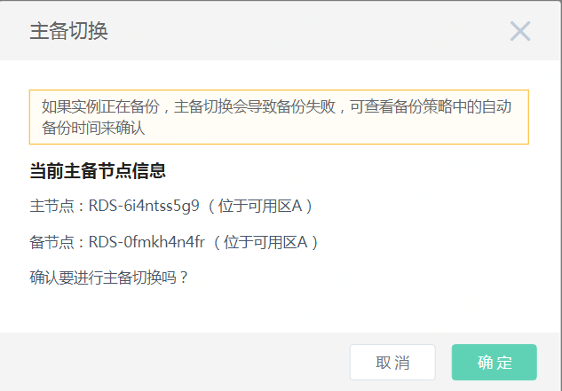

# 主备切换

#### 1. 点击【主备切换】
点击实例列表中【操作】下的【主备切换】或者实例详情列表右上方【操作】下的【主备切换】

#### 2. 在弹出的对话框中选择【确认】
实例状态变为“主备切换中”，切换完成后实例状态重新变为“运行”
可记录切换前主备节点后的ID，跟切换后的主备节点ID进行比对，确认切换成功。

**注意：主备切换和重启实例都会中断当前正在进行的备份操作，要尽量避免在备份进行时进行这两个操作。**
备份的开始时间可进入备份管理的备份策略页面进行查看。 如果不得不在备份进行时操作，建议操作完成后手工自行一次全量备份。

