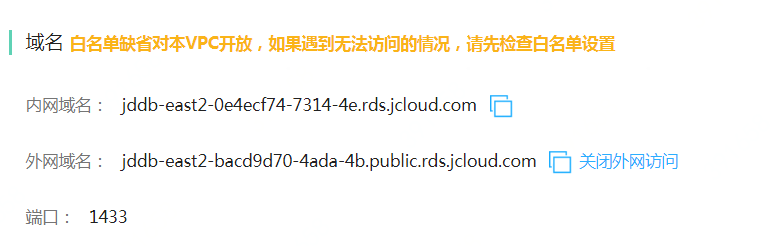

# 外网访问
配置数据库实例的外网访问

## 备注
- 出于安全性考虑，默认情况下，外网访问是关闭的。
- 开启外网访问前，请先设置白名单。
- 由于外网域名生效需要一定时间，请耐心等待3~5分钟。
- 如果关闭了外网访问，下次再次开启外网访问，访问地址会发生变化**
- 目前开启外网访问功能暂时免费

## 1. 开启外网访问
1. 登录 云数据库 RDS 控制台。
2. 选择需要开启外网访问的目标实例，点击目标实例，进入实例详情页。
3. 选择 资源信息 标签，在域名信息这块，点击 开启外网访问 按钮，会出现一个二次确认弹窗。

4. 在二次确认弹窗中，点击 确定 按钮。

5. 外网访问开启后，系统会自动分配一个外网域名地址。

## 2. 关闭外网访问
1. 登录 云数据库 RDS 控制台。
2. 选择需要关闭外网访问的目标实例，点击目标实例，进入实例详情页。
3.选择 【资源信息】，在域名信息这块，点击 关闭外网访问 按钮。

4. 在确认弹窗中，点击 确定 按钮，系统会关闭外网访问。

