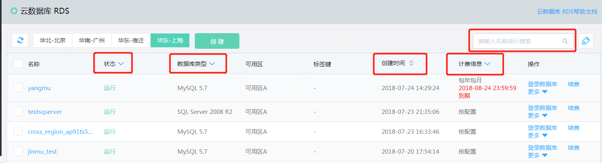

# 查看实例详情

## 1.  操作入口
- 实例列表页面会显示当前区域下的各个云数据库实例的概要信息，包括计费信息和过期时间
- 点击标题栏的对应标题，可以根据实例的状态，数据库类型，计费类型进行过滤；
- 可以根据创建时间进行排序；
- 在标题栏右上方的搜索框，可以根据实例的名字进行模糊搜索

## 2. 查看实例详情
点击要查看实例的名称，即可查看实例的详细信息,例如配置，网络，域名等
- 点击“名称”旁边的铅笔图标，可以修改实例的名称
- VPC名称和子网名称后的链接，可以跳转到网络的设置页面进行进一步查看和设置
- 点击域名后的图标，可以将域名拷贝到剪贴板中

