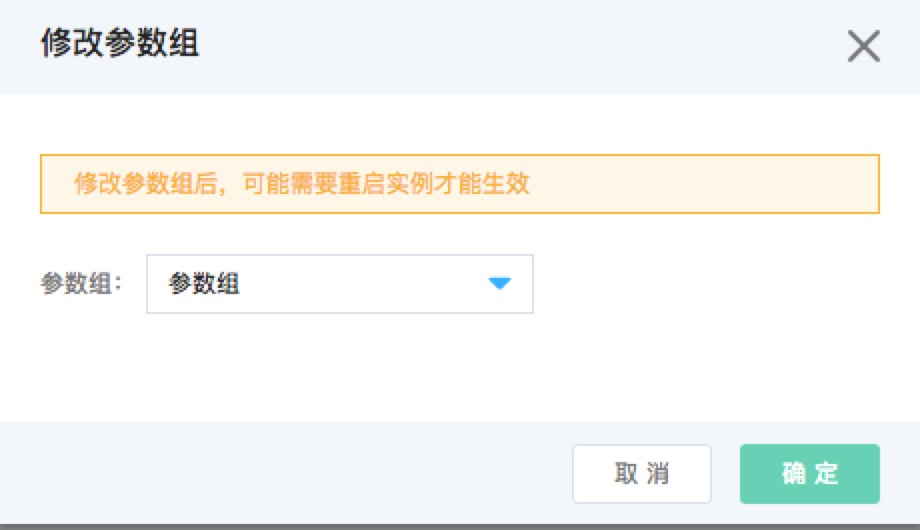

# 修改参数组
在进行参数组中参数调优的时候，你可能不希望修改现有参数组中的参数，可以使用修改参数组功能，绑定一个新的参数调优后的参数组。

## 注意事项
    * 实例处于运行态才能修改参数组

## 操作步骤
1. 登录 [参数组控制台](https://rds-console.jdcloud.com/paramgroup/list)
2. 选择需要修改参数组的目标实例，点击目标实例，进入实例详情页, 点击页面右上角的 操作=》修改参数组
3. 弹出框参数说明如下
    * 参数组：只列举和当前实例的数据库类型和版本匹配的参数组
    * 点击 ***确认*** 按钮，完成参数组修改
    * 点击 ***取消*** 按钮，放弃参数组修改

    

4. 修改参数组后，可能需要重启实例才能生效, 请确认参数组已经生效。 
