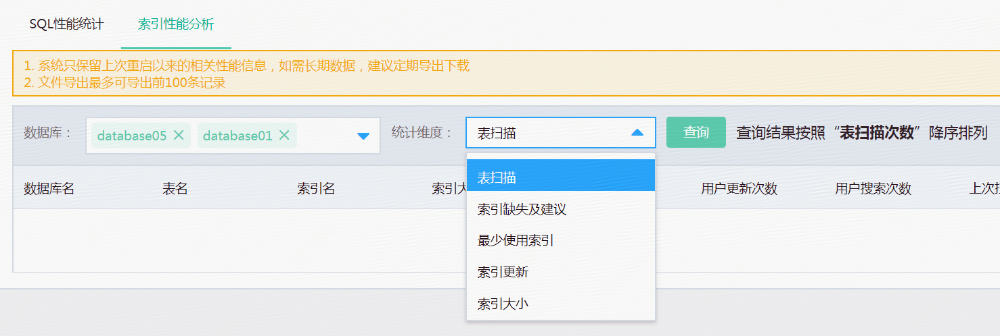

# 索引性能统计分析
索引性能分析可统计索引的使用情况，例如索引大小，表扫描，最少使用索引、索引更新情况等，并提供缺失索引及建议。

## 1. 选择数据库及性能指标
索引性能分析是基于单个数据库的，缺省情况下，将对所有数据库进行统计分析，用户也可选择1个或几个数据库进行分析。

## 2. 缺失索引及建议
缺失索引建议根据微软系统的得出，建议结合DBA或相关开发人员的人工判断

各个列的使用方式如下： create index <索引名> on <表名>(<相等列>,<不等列>) include(<包含列>) , 其中选择性高的列放在前面

详细的缺失索引的信息的使用及限制可以参考[微软官方文档](https://docs.microsoft.com/zh-cn/previous-versions/sql/sql-server-2008/ms345417(v%3dsql.100))

