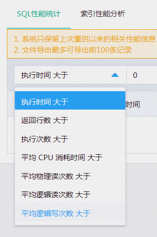
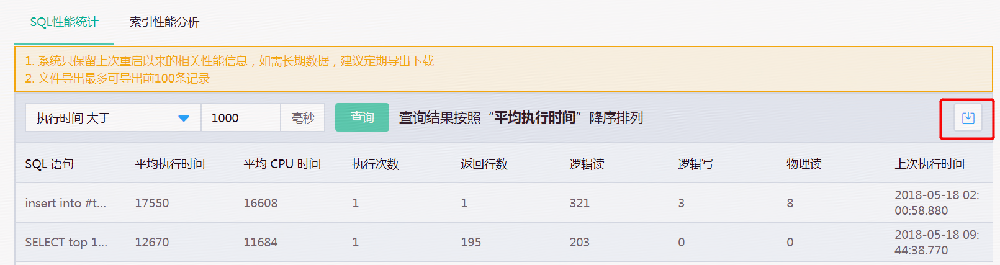

# SQL  性能统计
SQL 性能统计对数据库中的SQL执行情况，从各个不同的维护进行统计，例如慢SQL，返回结果集巨大的SQL等。同时用户还可以结合自己业务和系统的实际情况，定义统计的标准，满足不用应用和场景的需要。

**注意：由于性能统计数据仅保存在内存中，因此系统仅保留上次重启以来的相关性能信息。如需历史数据，建议定期在控制台或通过OpenAPI导出下载。**

## 2.支持7种统计维度
SQL 性能统计支持 以下7种统计维度

## 3. 自定义统计范围
可对每种统计维度自定义定义统计的范围（则缺省为0），例如：

## 4. 导出统计结果
可将统计结果导出为excel格式的文件，便于保存和发送给相关人员进行分析、优化

