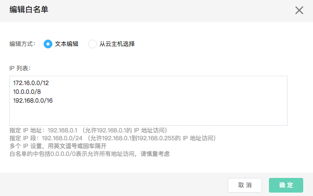

# 设置白名单
白名单控制哪些 IP 地址能够访问 RDS 实例。 默认情况下，实例所在的 VPC 段会在白名单列表中，即在该VPC中的所有IP都可以访问。如果用户需要开启外网访问，必须需要访问的外网的IP地址加入到白名单中。建议只添加真正需要从外网访问的IP地址，从而保证实例的数据安全性。修改后的白名单的会立即生效，不需要重启实例。

## 注意事项
* 默认情况下，实例所在的 VPC 段会在白名单列表中。
* 白名单不允许为空，需要至少要保留一个访问规则。

## 操作步骤
1. 登录 [云数据库 RDS 控制台](https://rds-console.jcloud.com/database)。
2. 选择需要设置白名单的目标实例，点击目标实例，进入实例详情页。
3. 选择 ***安全管理*** 标签，点击 ***名单设置*** 标签进入 ***白名单*** 的详情页，点击 ***编辑*** 按钮，弹出框参数说明如下：
- 编辑方式支持两种，分别为：***文本编辑*** 和 ***从云主机选择***
- 文本编辑方式需要您手动输入 IP 地址或者 IP 段，多个 IP 地址或者 IP 段通过逗号或者回车分隔。如果填写了 0.0.0.0/0，表示允许所有地址访问。
- 从云主机选择方式会显示所有和云数据库SQL Server 实例处于同一VPC的云主机实例，您只要勾选需要访问云实例的云主机，它的内网 IP 地址会自动添加到白名单规则中。

4. 点击 ***确定*** 按钮，白名单规则会立即生效。
