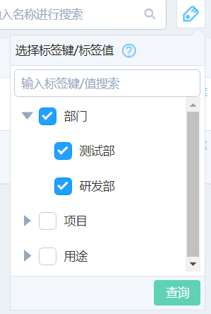

# 根据标签搜索

## 1.标签筛选 
在实例列表中，点击右上方的【标签管理】图标，展示筛选界面

再次点击【标签管理】图标，可隐藏筛选界面

## 2. 选择要筛选的标签
可根据输入键/值进行模糊搜索

相同键不同值之间为逻辑或关系，例如同时选择了“部门“为“测试部”和“研发部”的标签，则表示筛选出“部门“为“研发部”或“测试部”的实例。

勾选某个标签键/值，表示需要筛选出绑定了这个键值对的实例。例如选择“部门：研发部”的标签键，则只会将部门为研发部的实例筛选出来。

不同键之间为逻辑与关系，，若勾选了“部门：研发部”、“用途：ERP开发”则表示需要筛选出“部门”为“研发部”且“用途”为“ERP开发”的数据库实例。

## 3. 确认
选择完成后，点击【查询】筛选数据库实例。
