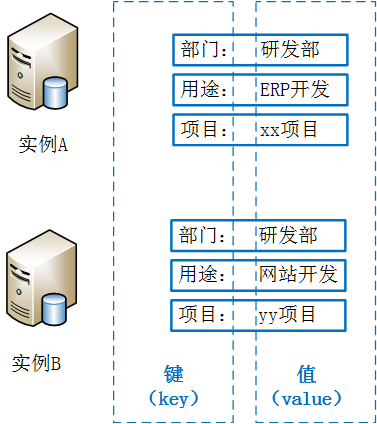

# 功能介绍
**“资源标签”** 提供一种可支持多种分类规范（如：所有者、用途等）的资源分类方法，方便用户在拥有大量同类资源时快速根据标签定位特定资源。标签由一对键/值（Key-Value）组成，均由用户定义。例如，用户可以根据云主机所有者标识其云主机资源。此外，建议用户对不同类型资源如云主机、云数据库等采用同一批标签，可以更加方便用户管理京东云上资源。

上图示意了标签实现情况，对“云数据库实例A”及“云数据库实例B”均绑定了三个标签，对应的键（key）分别为“部门”、“用途”及“项目”。其中
- 实例A的部门为研发部，用途为ERP开发，项目为xx项目
- 实例B的部门为研发部，用途为网站开发，项目为yy项目

## 备注
1. 暂时只支持SQL Server
2. 资源标签的功能处于内测阶段，只对邀请的客户开放。

## 支持功能
- 根据标签筛选 RDS
- 编辑标签

## 使用限制
- 每台云数据库实例最多可以绑定 10 个标签
- 标签键（Key）最大长度为127个字符（UTF-8）
- 标签值（Value）最大长度为255个字符（UTF-8）
- 标签键/值不可使用 jrn: 前缀，仅支持中文、数字、大小写字母、空格及特殊符号_.:/=+-@ ，不可以空格开头，区分大小写
- 每个资源只允许的任一标签的标签键（Key）必须唯一，相同标签键（Key）的标签会被覆盖；
- 解绑标签时，如果解绑之后该标签已经没有绑定的资源，则该标签会自动被删除
