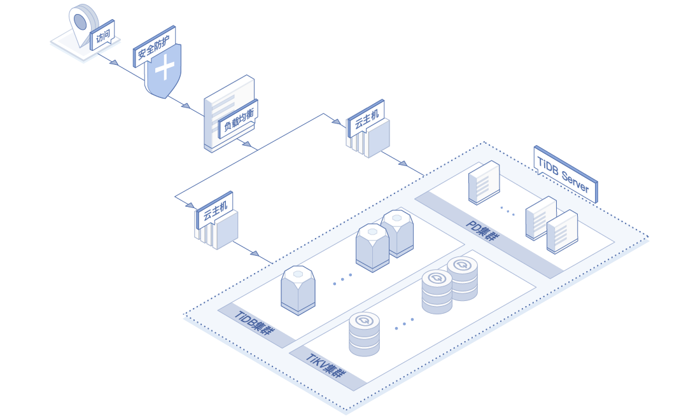
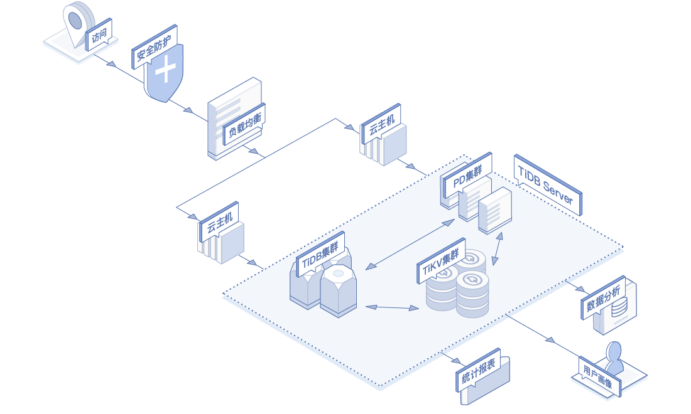

# 应用场景

## 海量数据的在线交易系统
TiDB支持强一致性的分布式事务，ACID 事务可以在多节点间进行，无需担心一致性问题。TiDB的处理能力和数据容量可以随着节点的增加而无缝的水平扩展，因此非常适合海量数据的在线交易系统

## 海量数据高性能实时分析
TiDB强大的分布式查询引擎可提供高性能的复杂SQL的查询能力，使联机交易和数据分析能够在一份数据上同时运行，摆脱了传统的ETL过程，适合各种需要实时数据分析的场景。

