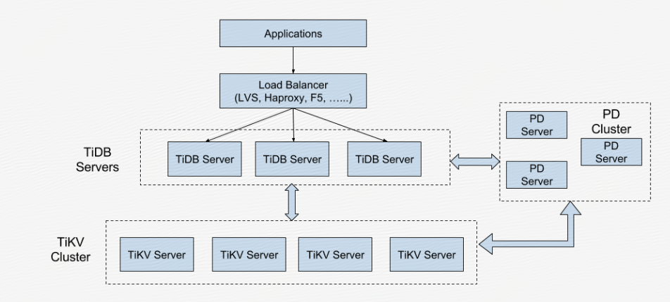

# 基础架构

TiDB 集群主要分为三个组件：
- **TiDB Server**
TiDB Server 负责接收 SQL 请求，处理 SQL 相关的逻辑，并通过 PD 找到存储计算所需数据的 TiKV 地址，与 TiKV 交互获取数据，最终返回结果。

- **TiKV Server**
TiKV Server 负责存储数据，从外部看 TiKV 是一个分布式的提供事务的 Key-Value 存储引擎。

- **PD Server**
Placement Driver (简称 PD) 是整个集群的管理模块，负责存储集群的元信息，对 TiKV 集群进行调度和负载均衡，并分配全局唯一且递增的事务 ID。

**架构图**

