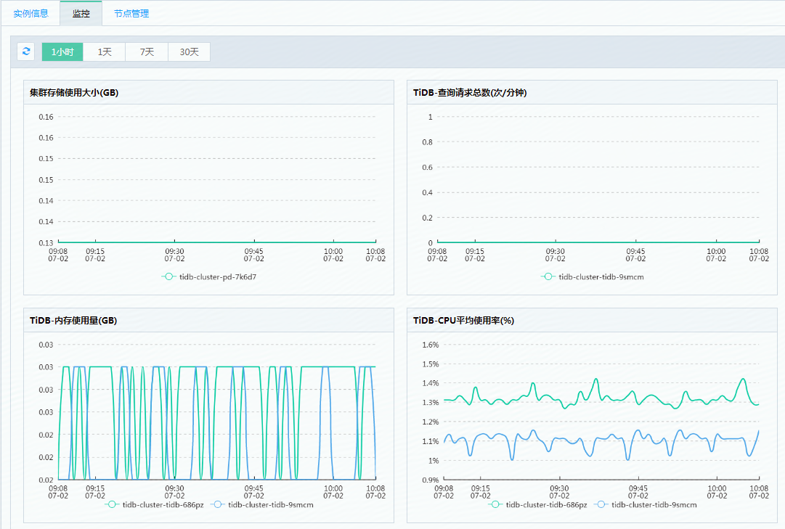

# 查看监控
在分布式数据库TiDB 的控制台，您可以查看多项数据库指标，通过数据库指标数据，您可以定位系统的问题所在，进行相应的系统优化。

## 操作步骤
1. 登录 分布式数据库TiDB 管理控制台。
2. 选择需要查看监控信息的目标实例，点击目标实例，进入实例详情页。
3. 选择 监控 标签，查看分布式数据库 TIDB 监控项
4. 默认显示的是 1小时 维度的监控数据，同时您也可以选择 1天，7天，30 维度。

## 监控项
|	监控项	|	指标单位	|	监控频率	|	监控周期	|
|:-|:-|:-|:-|
|	集群存储使用大小	|	单位：GB	|	60秒/次	|	30天	|
|	TiDB-查询请求总数	|	单位：次/分钟	|	60秒/次	|	30天	|
|	TiDB-数据库活跃连接数	|	单位：个	|	60秒/次	|	30天	|
|	TiDB-内存使用量	|	单位：GB	|	60秒/次	|	30天	|
|	TiDB-CPU平均使用率	|	单位：%	|	60秒/次	|	30天	|
|	TiDB-INSERT语句统计	|	单位：次/分钟	|	60秒/次	|	30天	|
|	TiDB-DELETE语句统计	|	单位：次/分钟	|	60秒/次	|	30天	|
|	TiDB-UPDATE语句统计	|	单位：次/分钟	|	60秒/次	|	30天	|
|	TiDB-SELECT语句统计	|	单位：次/分钟	|	60秒/次	|	30天	|
|	TiKV-使用空间	|	单位：GB	|	60秒/次	|	30天	|
|	TiKV-内存使用量	|	单位：GB	|	60秒/次	|	30天	|
|	TiKV-CPU平均使用率	|	单位：%	|	60秒/次	|	30天	|
