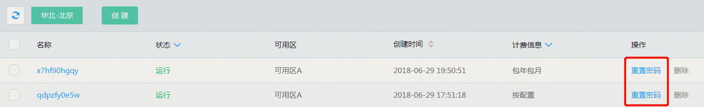

# 重置密码
在使用分布式数据库 TiDB 过程中，如果忘记数据库账号密码或者需要修改密码，可以通过 分布式数据库 TiDB 管理控制台 重新设置密码。

**注意事项**
为了数据安全，建议定期更换密码。

## 操作步骤
1. 登录 分布式数据库 TiDB 管理控制台。 
2. 选择需要重置账号密码的目标实例，点击 重置密码， 弹出框参数说明如下  
  密码：密码的长度和字符有一定限制，具体以控制台为准。 

