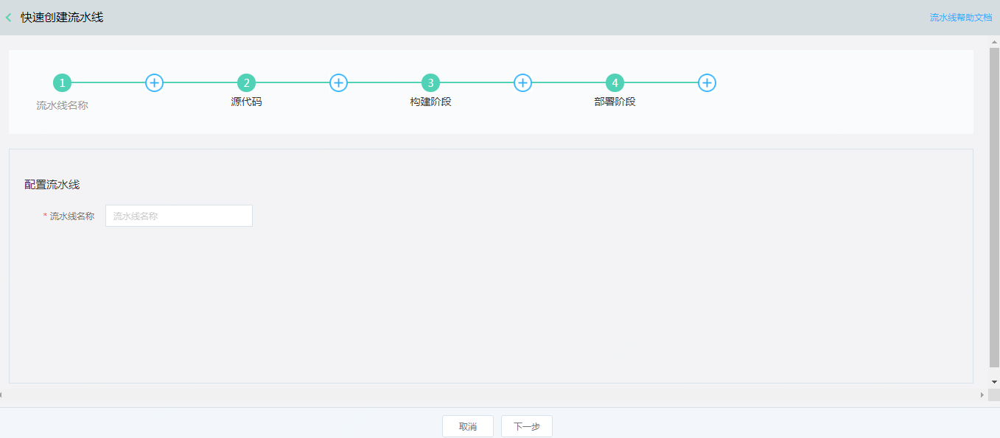
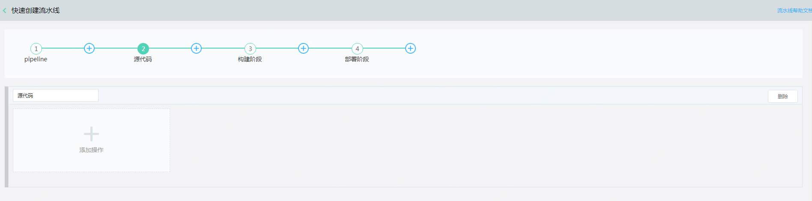

# 快速创建
通过快速创建功能，可根据模板快速创建代码-构建-部署。
操作步骤
1. 访问[流水线控制台](https://codepipeline-console.jdcloud.com/list)，或访问[京东云控制台](https://console.jdcloud.com)点击左侧导航栏【开发者工具】-【流水线】进入流水线列表页。

2. 在“流水线列表”页面，点击 快速创建 ，进入“快速创建”页面。
 

3. 默认流水线包含源代码、构建、部署阶段 
1)	配置流水线
流水线名称：您需要设置创建的流水线名，名称不可为空，只支持中文、数字、大小写字母、英文下划线“ _ ”及中划线“ - ”，且不能超过32字符
2)设置源代码
源代码阶段中，默认接入源代码类型的操作。一个阶段下至少需要有一个操作。
 
 
  操作名称：操作名称，一个流水线内保证名称的唯一性。不可为空，只支持中文、数字、大小写字母、英文下划线“ _ ”及中划线“ - ”，且不能超过32字符
	操作类型：源代码
	操作提供方：支持codecommit、GitHub。
	存储库：代码库名称
	分支：指定编译分支
	手工确认：该操作执行方式，默认自动流转

	设置构建阶段
构建阶段中，默认接入构建类型的操作。
 

 
	操作名称：操作名称，一个流水线内保证名称的唯一性。不可为空，只支持中文、数字、大小写字母、英文下划线“ _ ”及中划线“ - ”，且不能超过32字符
	操作类型：构建
	操作提供方：codebuild
	输入项目：构建的源代码即为本次操作的输入项目。下拉内容为，本流水线中创建的类型为源代码的操作。
	项目：构建对应的项目，即在云编译（codebuild）中已经创建的项目。如果没有项目，可通过创建新项目 按钮，快速创建一个编译项目。
	手工确认：该操作执行方式，默认自动流转。选择手工确认后，流程执行到本操作会停止。用户在页面点击确定方可继续执行。

	设置部署阶段
部署阶段中，默认接入部署类型的操作。
 

 

 
	操作名称：操作名称，一个流水线内保证名称的唯一性。不可为空，只支持中文、数字、大小写字母、英文下划线“ _ ”及中划线“ - ”，且不能超过32字符
	操作类型：部署
	操作提供方：Kubernetes集群
	输入项目：部署的源代码或者编译的产出物即为本次操作的输入项目。下拉内容为，本流水线中创建的类型为源代码及构建的操作。
	项目：Kubernetes集群中对应的项目，即在Kubernetes集群中已经创建的项目。如果没有项目，可通过创建新项目 按钮，快速创建一个编译项目。
	手工确认：该操作执行方式，默认自动流转。选择手工确认后，流程执行到本操作会停止。用户在页面点击确定方可继续执行。

4、	创建完成，在流水线列表页面可以看到刚刚创建的记录。

