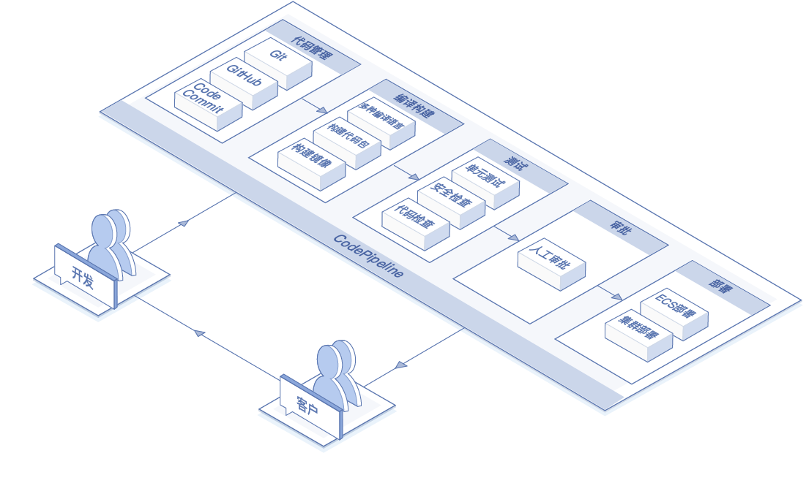
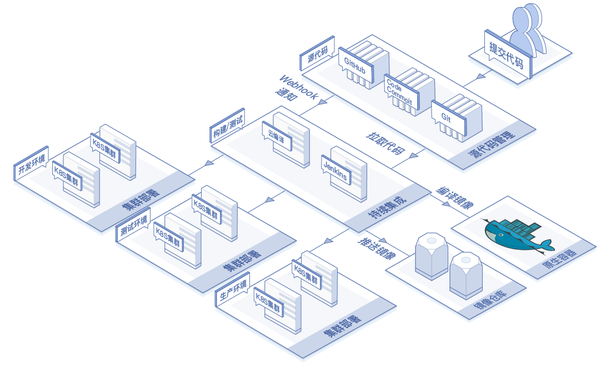

# 应用场景
## DevOps 持续交付
* 场景描述：通过CodePipeline，可以帮助您完成从代码变更到构建，测试和部署的DevOps完整流程，确保只有通过自动测试的代码才能交付和部署，高效替代业内部署复杂、迭代缓慢的传统方式。
* 使用产品：DevOps、代码托管、云编译

## 集成k8s集群

* 场景描述：与京东云容器服务深度集成，不仅能够提供Docker Image的构建并上传至容器镜像仓库，还和Kubernetes集群打通做到Docker容器化应用的自动化持续交付。
* 使用产品：原生容器、Kubernetes、集群云编译

