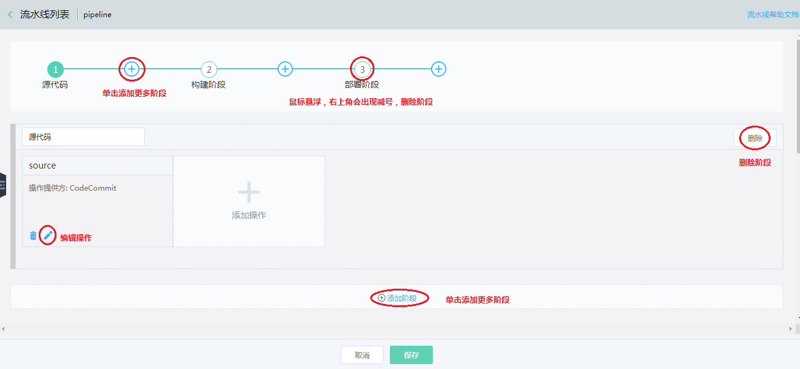

# 编辑流水线

点击流水线列表中的 编辑 按钮，编辑流水线。正在运行状态的流水线是不可编辑的。

 

   * 添加阶段：提供了两种添加阶段的方式。单击导航流中的加号或者单击页面上的 添加阶段 按钮
   * 编辑阶段：可编辑阶段名称
   * 添加操作：单击页面 添加操作 按钮，可添加更多自定义的操作
   * 编辑操作：单击操作里面的编辑图标，打开操作编辑页面
   * 删除阶段：提供了两种删除阶段的方式。鼠标悬浮导航流中的阶段，右上角会出现删除图标。也可以通过阶段上的删除 按钮进行删除。
   * 删除操作：单击操作里面的删除图标，删除操作。
