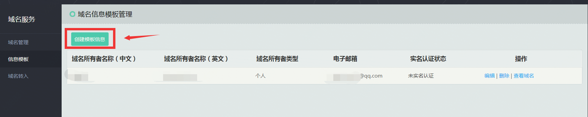
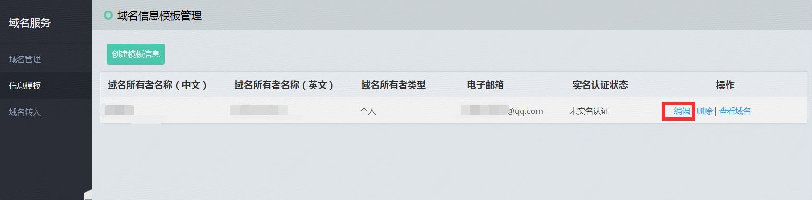

# 创建信息模版

1. 打开京东云主页，进入域名服务界面。

2. 点击此处创建一个新的信息模板

3、按照提示填写信息即可。

 
4、已有信息模板需要修改，选择已有信息模板，点击编辑，即可修改。

温馨提示：

1.若您的域名需要备案，请务必将信息模板完成实名认证，且实名认证信息需与备案主办单位信息一致。

2.域名英文所有者信息应如何填写？

根据注册局规定，国际域名和国别域名所有者信息是以英文信息为准，因此您在注册此类域名时，填写的域名所有者英文信息 要求真实、准确。

如果没有英文公司名称，可以填写与中文名称相同的完整拼音。例如：北京例子科技有限公司，英文信息可填写为bei jing li zi ke ji you xian gong si

