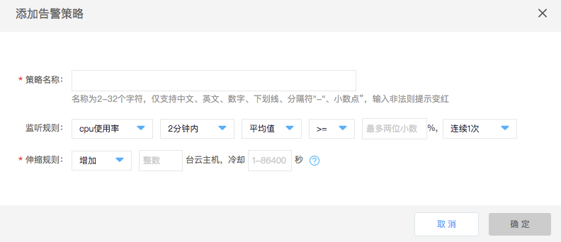
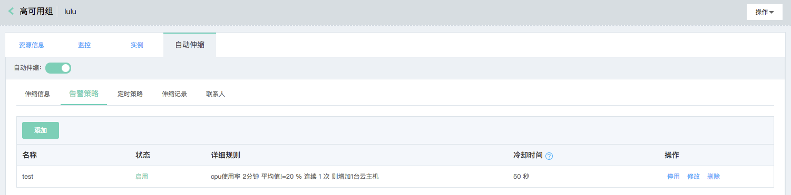
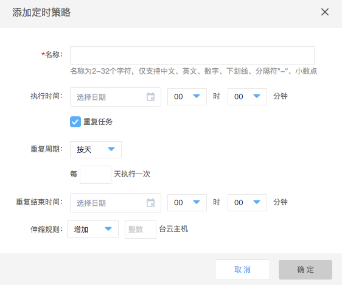
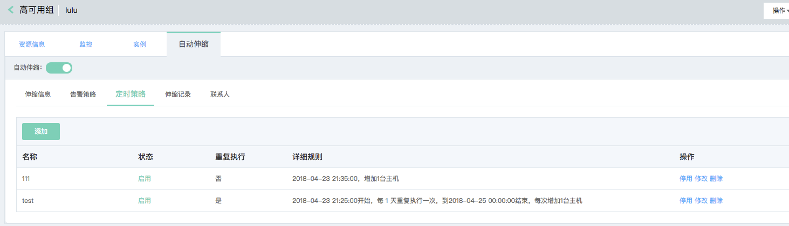

# 入门指南

完整地使用京东云可用组部署高可用业务，您需要按照以下四步来完成：

## 第一步：创建实例模板

实例模板定义了高可用组内云主机实例的配置信息，包括镜像、云主机规格、系统盘及数据盘类型和容量、私有网络及子网配置、安全组及登录信息等。

### 前提条件：

* 您可预先[创建私有网络](../../Networking/Virtual-Private-Cloud/Operation-Guide/VPC-Configuration.md)、[创建子网](../../Networking/Virtual-Private-Cloud/Operation-Guide/Subnet-Configuration.md)或随云主机一起创建私有网络及子网。
* 若您需要在Linux云主机上使用SSH密钥登录实例，您可预先[创建SSH密钥](../Virtual-Machine/Operation-Guide/Key-Pair/Create-Keypair.md)或随云主机一起创建SSH密钥。
* 若您需要使用安全组进行云主机的安全访问控制，您可预先[创建安全组](../../Networking/Virtual-Private-Cloud/Operation-Guide/Security-Group-Configuration.md)、[配置安全组](../../Networking/Virtual-Private-Cloud/Operation-Guide/Security-Group-Configuration.md)或随云主机一起创建安全组。

### 创建步骤

1. 访问[实例模板控制台](https://cns-console.jdcloud.com/host/launchtemplate/list)，即进入实例列表页面。或访问[京东云控制台](https://console.jdcloud.com)点击左侧导航栏【弹性计算】-【云主机】-【实例模板】进入实例模板列表页。
2. 选择地域
3. 点击【创建】，进入实例模板创建页面
4. 选择地域：在此步骤仍可以选择新建实例模板对应的地域，请注意不可跨地域使用实例模板，例不支持使用华南-广州地域的实例模板创建华北-北京地域云主机。如果所选地域限额已满，可以通过提交工单提升限额。
5. 设置实例模板名称、描述
6. 选择镜像：
	
	京东云为您提供以下镜像类型：
	
	* 官方镜像：由京东云提供和维护的公共镜像，支持Linux和Windows的多个发行版本，提供基础操作系统、初始化组件及部分预装软件，所有用户均可以使用。
	* 私有镜像：基于用户自有云主机创建自定义镜像，您可以为已部署业务的主机制作镜像，基于此镜像快速创建多个具有相同配置和软件环境的主机。您可以将私有镜像共享给同其他京东云用户，被共享镜像会显示在目标用户同区域的共享镜像列表中。私有镜像支持删除和基本信息修改。
	* 共享镜像：由其他京东云用户通过镜像共享功能所分享而来的用户自定义镜像，展示区域与被共享的私有镜像相同。共享镜像仅可用于创建云主机，不可进行基本信息修改、删除等操作，若发起共享的用户取消了共享，则该镜像会从列表中自动删除。
	* 镜像市场镜像：由入驻云市场的服务商所提供的镜像，集成了针对不同业务场景的运行环境或软件，方便用户快速部署业务
	
	对于初次使用京东云的用户可以选择京东云提供的“官方镜像”，您可以根据需要选择对应的系统，并选择合适的版本。如果您已经创建好自己的实例，并配置好相应的环境，可以将此实例进行制作私有镜像操作，同时基于此镜像批量创建有相同系统及环境配置的主机，还可以将此私有镜像共享给其他京东云用户。

7. 选择规格：京东云实例规格支持用户自定义选择：用户可以根据不同业务场景选择实例规格及相应配置，详细请查阅[实例规格类型]()。

		请注意：若您计划使用该实例模板创建可用组，您需要选择第二代规格，如g.n2.large。

8. 选择存储：京东云提供云硬盘和本地硬盘两种类型。
	
	云硬盘：采用一盘多备的分布式存储方式，数据可靠性高；
	
	本地盘：处在云服务器所在的物理机上的存储设备，可以获得较低的时延，但存在单点丢失风险。

	云主机系统盘：支持本地盘及云硬盘，其中本地盘免费40GB，且容量不可变更。云硬盘支持40GB~500GB。

	云主机数据盘：支持挂载8块数据盘，可选高效云盘和SSD云盘，云硬盘挂载到云主机后，需要进入云主机操作系统挂载云硬盘。

		高效云盘做数据盘：支持范围20GB~3000GB

		SSD云盘做数据盘：支持范围20GB~1000GB

	您可以随实例创建指定类型和容量的空盘，也可以基于已有云硬盘快照创建数据盘（基于快照创建的数据盘类型暂不支持调整，容量调整范围下限为快照容量），如您选择的私有镜像中包含了预设的数据盘配置信息，则选择私有镜像后会自动按照镜像中的设备映射信息配置数据盘，如您仅希望使用镜像的部分默认配置，也可以对其进行删减（不支持在默认配置上更换快照，如欲更换快照请删除默认配置后单独添加新盘后选择快照）。关于数据盘设备名分配规则请查阅设备名分配规则。

9. 选择网络：您需选择“私有网络”及“子网”，选择子网后，可以判断该子网下，还有可以创建的云主机数量，如果暂时没有子网，可以通过快速入口新建子网，并在“云主机网络”进行选择，详细请查阅私有网络和子网。        

	选择对应的已创建的安全组，安全组为必选项，安全组也可以通过快速入口创建，详细请查阅创建安全组，完成创建后，在“网络”进行选择。

10. 选择公网带宽：

	京东云提供的公网IP带宽类型为按固定带宽计费及按使用流量计费，按固定带宽计费按购买时设置的带宽上限值计费，而与您实例当前实时访问公网带宽无关，按使用流量计费则根据您实时访问公网的实际流量计费。线路分为：BGP和非BGP，若您需要更快更高效的网络接入请选用BGP。        

	带宽范围为：1Mbps~200Mbps，支持可以暂不配置公网IP，使用实例模板创建云主机后，再另行购买绑定。

	公网IP带宽费用与实例费用独立。具体价格信息请参加[公网IP价格]()。**请注意实例模板服务免费，以下计费信息为基于实例模板创建云主机时的预估收费信息。
**
	<table>
	   <tr>
	      <td >实例计费方式</td>
	      <td >公网带宽计费方式</td>
	      <td >费用估算</td>
	   </tr>
	   <tr>
		   <td rowspan="2">按配置  </td>
	      <td >按固定带宽 </td>
	      <td > 配置费用，包括：实例规格（CPU 和内存的配置）、云硬盘（如果配置）、和弹性公网IP带宽的费用。</td>
	   </tr>
	   <tr>
	      <td >按使用流量 </td>
	      <td > 公网流量费用 + 配置费用。其中，配置费用包括：实例规格（vCPU和内存的配置）、云硬盘（如果配置）的费用及弹性公网IP配置费。          </td>
	   </tr>
	   <tr>
		   <td rowspan="2">包年包月  </td>
	      <td >按固定带宽 </td>
	      <td > 配置费用，包括：实例规格（vCPU和内存的配置）、云硬盘（如果配置）、和弹性公网IP带宽的费用。</td>
	   </tr>
	   <tr>
	      <td >按使用流量 </td>
	      <td > 公网流量费用 + 配置费用。其中，配置费用包括：实例规格（CPU 和内存的配置）、云硬盘（如果配置）的费用及弹性公网IP配置费。    </td>
	   </tr>
   </table>

11. 配置登录信息：

	Windows系统，登录用户名为administrator；Linux系统，登录用户名为root；

	可以选择“立即设置”或“暂不设置”登录密码，若选择“暂不设置”，在使用启动模板创建云主机时系统会以短信和邮件方式发送随机密码，建议您创建云主机完成后通过控制台修改密码。

	对于Linux系统，还可以选择SSH密钥登录，通过绑定已经创建的SSH密钥进行更安全的实例登录认证，详细SSH密钥创建及登录帮助，请参考 [SSH密钥]()。

实例模板免费，页面右侧将显示您已配置的信息，同时会展示根据您的配置，基于此启动模板创建实例的预估费用：包括包年包月计费情况下每月费用及按配置计费情况下每小时费用。费用包括云硬盘及按固定带宽计费公网IP的费用，若您选择按流量计费公网IP则将单独列出。

## 第二步：创建高可用组

高可用组是京东云提供的业务高可用部署解决方案，是计算资源逻辑集合。提供了组内单元在数据中心内横跨多个故障域均衡部署的机制，示例分散部署在相互隔离的物理资源上，当出现硬件故障或定时维护时只会影响部分实例，您的业务仍为可用状态。

1. 访问[高可用组控制台](https://cns-console.jdcloud.com/availabilitygroup/list)，即进入高可用组列表页面。或访问[京东云控制台](https://console.jdcloud.com)点击左侧导航栏【弹性计算】-【高可用组】进入高可用组列表页。
2. 选择地域
3. 点击【创建】，进入高可用组创建页面
4. 选择地域：在此步骤仍可以选择新建高可用组对应的地域。如果所选地域限额已满，可以通过提交工单提升限额。
5. 设置高可用组的可用区属性，为保障最优的业务可用性，建议选择多可用区。高可用组内云主机将在高可用组内均匀分布，降低当单个可用区出现物理故障时对您业务的影响。
6. 设置高可用组名称及描述，如：Web服务高可用组。
7. 选择实例模板，下拉框将列出当前地域下满足条件的实例模板，请注意需选择配置了第二代云主机规格的实例模板，此处选择上一步创建的“Web服务实例模板”。
8. 点击【确定】触发创建高可用组，您将在高可用组列表页看到创建成功的高可用组。

## 第三步：新增云主机

当选择高可用组来部署业务时，需要向高可用组内新增云主机实例，高可用组不支持添加已创建的实例，故新增实例即新建实例。创建实例需先进行实名认证，若您需要创建按配置计费的云主机，您还需要保证您账户余额+可用代金券需大于50元。

1. 访问[高可用组控制台](https://cns-console.jdcloud.com/availabilitygroup/list)，即进入高可用组列表页面。或访问[京东云控制台](https://console.jdcloud.com)点击左侧导航栏【弹性计算】-【高可用组】进入高可用组列表页。
2. 选择地域。
3. 找到需要新增实例的高可用组。
4. 点击【新增实例】，将跳转至云主机创建页面，且创建方式为“在高可用组内创建”，对应高可用组选中为对应高可用组，如：Web服务高可用组。将根据高可用组所关联的实例模板内配置的信息匹配至当前页面。但需注意这些配置信息不允许修改。
5. 您可以选择不同计费类型及购买数量，计费类型氛围包年包月或按配置计费，若购买包年包月云主机您需要指定购买时长。
6. 若您单次仅新增一台云主机，则您还可以指定其内网IP地址，需注意的是内网地址需在对应子网CIDR范围内；
7. 设置云主机名称及描述；
8. 完成以上配置后，点击【立即购买】，对于包年包月云主机完成之后及可在高可用组详情页或云主机列表页查看创建的云主机，对于按配置计费云主机则将直接触发创建。云主机从创建到可用将有几分钟时间，还请耐心等待。

若高可用组关联的实例模板配置了已经部署好业务且配置了开机自启动的私有镜像，当您完成新增实例时可认为您获得了一组可对外服务的且高可用的云主机组。

## 第四步：开启自动伸缩（可选）

高可用组开启自动伸缩后，可设置基于监控指标（如CPU、内存利用率）配置的告警策略以及预先设置时间，到预设时间后自动伸缩的定时策略来进行云主机数量的增减，以应对业务负载波动情况。

### 开启自动伸缩

1. 访问[高可用组控制台](https://cns-console.jdcloud.com/availabilitygroup/list)，即进入高可用组列表页面。或访问[京东云控制台](https://console.jdcloud.com)点击左侧导航栏【弹性计算】-【高可用组】进入高可用组列表页。 
2. 找到对应高可用组名称。
3. 点击【操作】-【开启自动伸缩】。
4. 在弹出弹窗中指定高可用组的最小实例数、最大实例数及移除策略。
		
		高可用组内实例数将维持在最小伸缩数与最大伸缩数之间。若当前高可用组内实例数小于最小实例数，高可用组将自动新增实例，使其等于最小实例数，需要注意的是自动新增的云主机均为按配置计费；若当前高可用组内实例数大于最大实例数，高可用组将自动按照移除策略移除实例，使其等于最大实例数，需要注意的是自动移除的云主机将直接删除，不同于您手动移除，同时不会自动移除包年包月云主机。

5. 点击【确定】则触发开启自动伸缩。

开启自动伸缩后，您还可以配置告警策略和定时策略。

### 创建告警任务

* 在高可用组详情页自动伸缩tab页内选择【告警策略】选项卡，点击【添加】；
* 在添加弹窗设置告警策略，基于监控性能指标（如CPU、内存等），自动为高可用组增加减少指定台数实例。

完成设置后，该告警策略将显示在页面的列表中，示例如下：

### 创建定时任务

* 在高可用组详情页自动伸缩tab页内选择【告警策略】选项卡，点击【添加】；

* 在添加弹窗指定定时策略名称、执行时间和伸缩规则等信息。您也可以勾选【重复任务】以定义周期定时执行任务。

完成设置后，该定时策略将显示在页面的列表中，示例如下：

## 相关参考

[创建私有网络](../../Networking/Virtual-Private-Cloud/Operation-Guide/VPC-Configuration.md)

[创建子网](../../Networking/Virtual-Private-Cloud/Operation-Guide/Subnet-Configuration.md)

[创建SSH密钥](../Virtual-Machine/Operation-Guide/Key-Pair/Create-Keypair.md)

[创建安全组](../../Networking/Virtual-Private-Cloud/Operation-Guide/Security-Group-Configuration.md)
