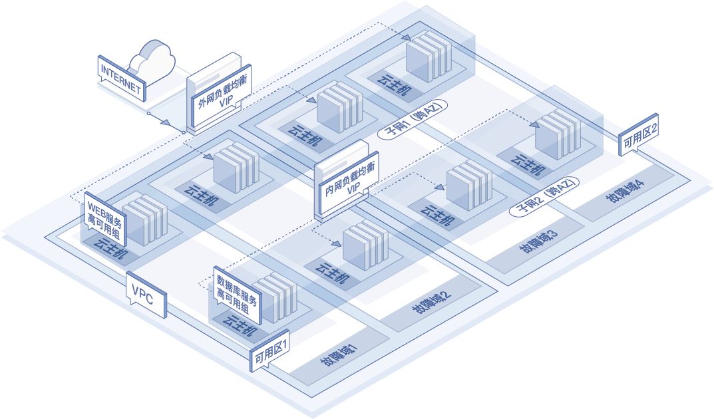
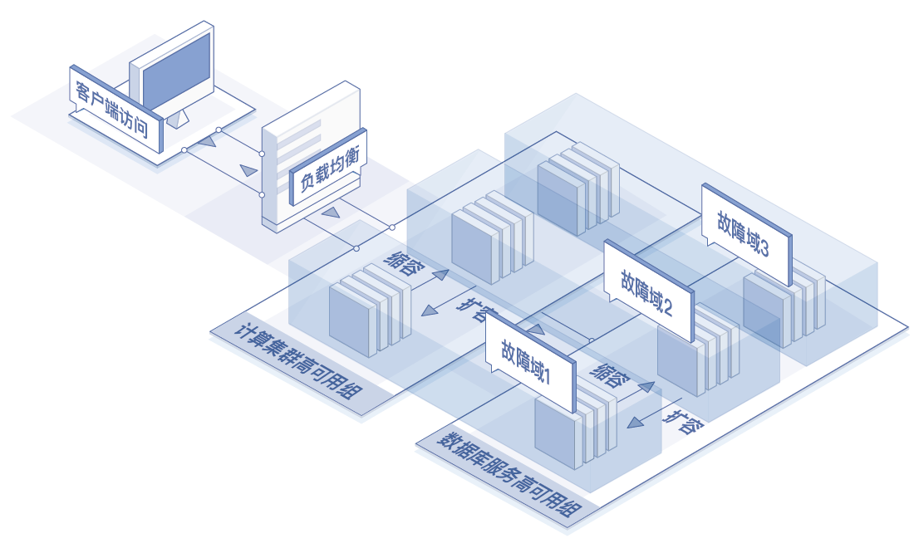

# 应用场景

## 高可用Web应用

* 场景描述： 将业务不同服务采用不同可用组部署，隔离服务层故障影响。 京东云高可用组将保证Web服务对应的云主机实例分散在物理资源上，数据库服务对应的云主机也分散在不同物理资源上。当某一台Web服务云主机所在物理资源出现故障时，其他Web服务实例以及数据库服务实例不受影响，保证您业务高可用。
* 建议配置：Web服务实例使用一个高可用组，数据库服务实例使用一个高可用组。两个高可用组均跨可用区。
* 

## 弹性高性能计算应用

* 场景描述：计算请求通过负载均衡到达应用服务器，当您计算量波动时，支持您基于监控指标配置告警伸缩策略，自动触发新增或删除云主机，保障集群计算能力，节省业务部署成本。若可预估计算量波动情况，您可预先规划可用组内云主机数量并配置定时伸缩策略，定时触发新增或删除云主机。
* 建议配置：计算集群实例使用一个高可用组，数据库服务实例使用一个高可用组。两个高可用组均开启自动伸缩功能。
 
