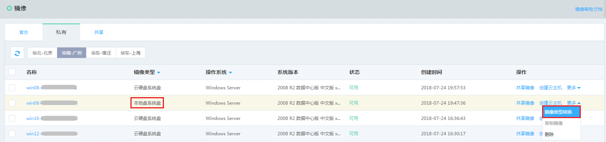
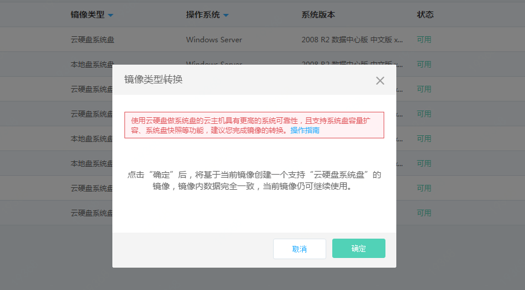

# 镜像类型转换
由于创建本地系统盘云主机和云盘系统盘云主机所需的镜像格式不同，因此如您希望使用基于本地系统盘云主机制作的私有镜像来创建云盘系统盘云主机，需要通过【镜像类型转换】操作基于当前镜像生成一个新的镜像，两种镜像类型分别为“本地盘系统盘”和”云硬盘系统盘“。

镜像系统盘类型可以通过查看镜像列表或详情中的“镜像类型”字段来获知，您只需根据需求对私有镜像进行转换，官方镜像和云市场镜像会同时提供两种类型的镜像。

## 前提条件

* 仅镜像类型为“本地盘系统盘”且状态为“可用”的私有镜像支持转换操作；
* 由于转换操作会占用镜像配额和云硬盘快照配额，因此请在操作前确保镜像所在地域下私有镜像和云硬盘快照配额充足。

## 注意事项 

* 转换操作会创建一个与原镜像数据内容完全一致，仅镜像类型不同的新镜像，原镜像仍会保留，可以继续用来创建本地盘系统盘的实例。
* 转换操作是单向的，“云硬盘系统盘”镜像不可反向转换为“本地盘系统盘”镜像。
* 仅满足条件的私有镜像可以转换，如共享镜像需要转换，请联系共享方进行镜像转换后对新镜像重新进行共享。
* 转换操作不会改变源镜像的状态，但在转换操作完成前，镜像不可删除，不可再次提交转换请求，其余操作（查看、修改信息、创建云主机实例等）不受影响。
* 转换操作将会为镜像的系统盘部分生成一个云硬盘快照，快照名称与镜像名称相同，并可在云硬盘快照列表中查看；如原镜像包含数据盘快照，转换操作不会重新生成新的数据盘快照副本，这些快照会同时与新、旧两个镜像关联；如希望删除快照，需要先行删除与其关联的两个镜像。
* 通过镜像转换操作生成的系统盘快照，可以作为独立的快照资源用来单独创建云硬盘，但在镜像删除之前不支持删除该快照。

## 操作步骤
1. 访问[镜像控制台][1]，即进入镜像列表页面。或访问[京东云控制台][2]点击左侧导航栏【弹性计算】-【云主机】-【镜像】进入镜像列表页。
2. 选择【私有镜像】TAB，选择需要转换的私有镜像(镜像类型须为本地盘系统盘)，点击【更多】操作中的【镜像类型转换】。 

3. 在确认弹窗中点击【确定】，开始镜像转换任务。新镜像名称、系统盘快照名称均默认与原镜像相同，可创建完成后自行修改。

  [1]: https://cns-console.jdcloud.com/host/image/list
  [2]: https://console.jdcloud.com/
 