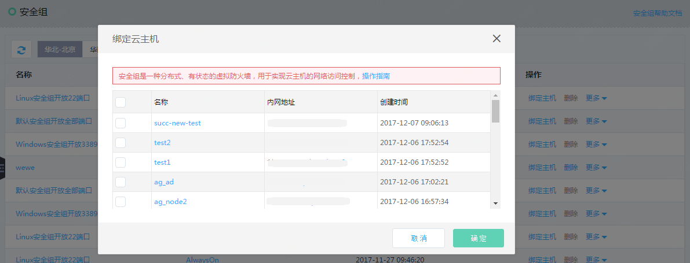

# 安全组绑定实例
您可以在实例创建时绑定安全组，也可以在实例创建之后，在安全组页面选择安全组与指定实例绑定。
云主机必须与至少一个安全组绑定。

1. 访问[安全组控制台][1]，或访问[京东云控制台][2]点击左侧导航栏【弹性计算】-【云主机】-【安全组】进入安全组列表页，点击【绑定主机】，弹出绑定云主机弹窗；或者点击安全组名称进入安全组详情页，选择“云主机”TAB页，点击【添加】按钮，弹出绑定云主机弹窗。

2. 绑定云主机弹窗提供了当前私有网络下所有可用的云主机实例列表，您可以勾选一台或多台，点击【确定】按钮，为已选中的云主机绑定当前安全组。

  [1]: ./images/Operation-Guide-SG-bind1.png "Operation-Guide-SG-bind1.png"
  [2]: ./images/Operation-Guide-SG-bind1.png "Operation-Guide-SG-bind1.png"
  [3]: ./images/Operation-Guide-SG-bind2.png "Operation-Guide-SG-bind2.png"