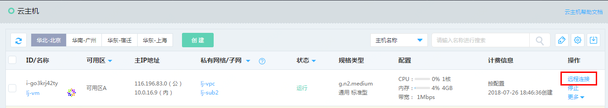
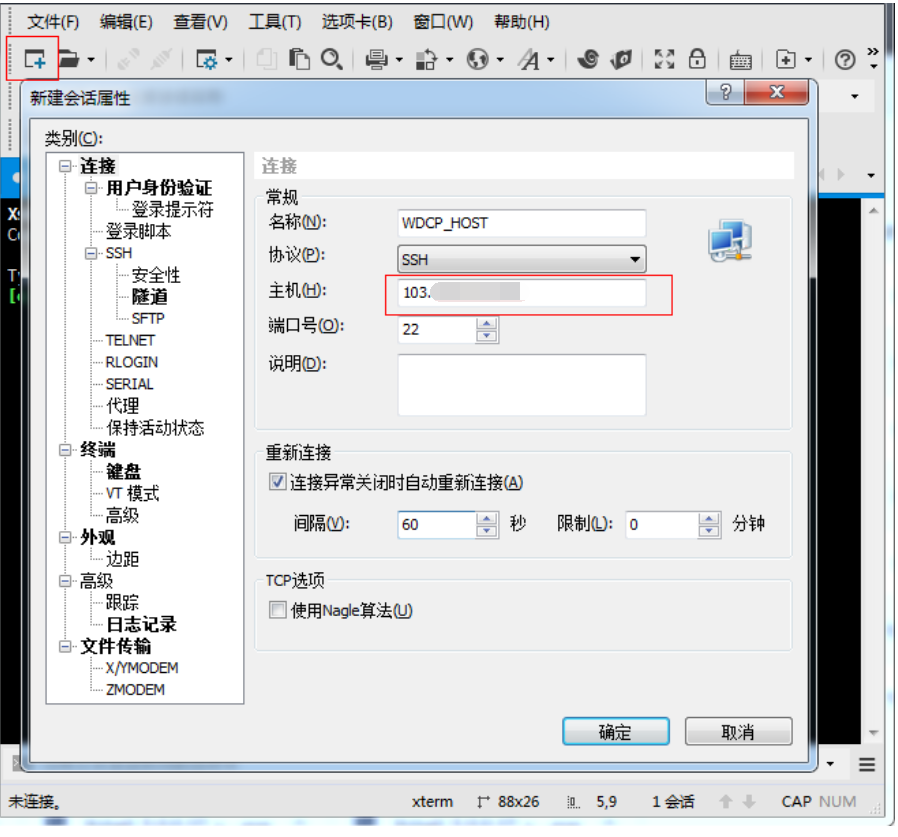
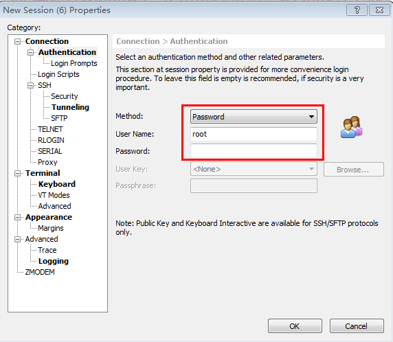
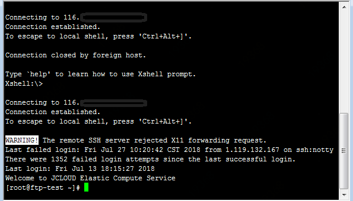
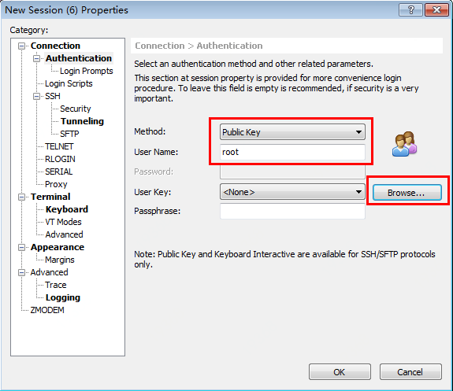
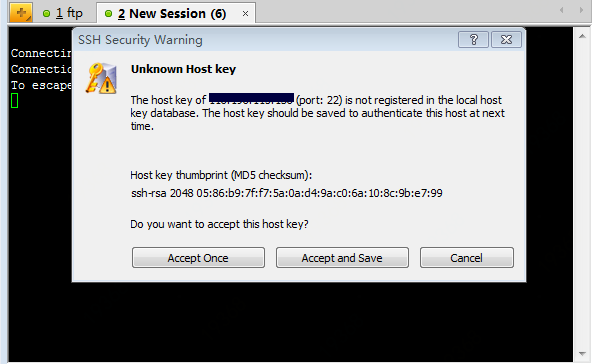
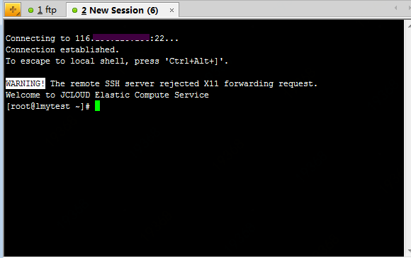

# 登录Linux实例
在购买并启动了 Linux 类型的实例后，您可以选择登录实例进行相关管理。根据您本地的操作系统和实例是否可被 Internet 访问，不同情况下可以使用不同的登录方式，具体内容可参考下表：
<table>
   <tr>
      <td> 本地操作系统类型 </td>
      <td> Linux实例已绑定弹性公网IP  </td>
      <td> Linux实例未绑定弹性公网IP </td>
   </tr>
   <tr>
      <td> Wndows </td>
      <td> VNC 登录<br>通过远程登录软件使用密码/密钥登录  </td>
      <td rowspan="2"> VNC登录 </td>
   </tr>
   <tr>     
      <td> Linux / Mac OS</td>
      <td>VNC 登录<br>使用密码/密钥登录   </td>
   </tr>
</table>

## 登录准备
创建实例并获取账号和对应密码：

* 管理员账号：root
* 密码：京东云实例可以通过两种方式获取密码
  *  在创建实例时，选择【暂不设置 】，则系统将以短信及邮件方式发送默认密码，您可以在登录实例时，使用默认密码进行验证。
  *  选择【立即设置】，则在密码设置文本框中输入自定义密码，如果忘记密码，可以通过[重置密码](../Operation-Guide/Instance/Reset-Password.md)功能重新设置密码，此功能只有“运行”状态实例可用。

## 使用VNC登录Linux实例
VNC登录是京东云为用户提供的一种通过 Web 浏览器远程连接实例的方式。在没有安装远程登陆客户端或者客户端远程登陆无法使用的情况下，用户可以通过 VNC 登陆连接到实例，观察实例状态，并且可通过实例用户进行基本的实例管理操作。
VNC登陆的场景至少包括以下几种：

* 查看实例的启动进度
* 无法通过远程登录软件或密钥登录时，通过 VNC 登陆来登录实例。

1. 在实例列表的操作列，点击【远程连接】即可通过 VNC 连接至Linux实例。


2. 点击VNC之后进入到登录页面
* 默认用户名：root        
* 密码：为您创建实例时设置的实例密码 


请注意：

* 同一浏览器下，同一时间只支持使用VNC登录一台实例。
* 要正常使用VNC登录，建议使用高版本浏览器，如：Chrome，Firefox，IE10及以上版本等。
* 暂不支持复制粘贴。
* 暂不支持文件上传下载。

## 本地为Windows，通过远程登录软件使用密码/密钥登录
您可选择多种远程登录软件登陆京东云Linux实例，如选择使用SSH密钥登录实例，需要在创建实例时选择开启密钥登录功能，并为其绑定一个密钥，请确保已下载所绑定密钥的私钥。有关密钥的创建操作，请参阅[创建SSH密钥](../Operation-Guide/Key-Pair/Create-Keypair.md)。

同时请您查看实例关联[安全组](http://docs.jdcloud.com/cn/virtual-private-cloud/security-group-features)及所在子网的[网络ACL](http://docs.jdcloud.com/cn/virtual-private-cloud/network-acl-features)配置，确保实例22端口已开放。

本例以 CentOS 7.1 64位系统，Xshell远程登录软件为示范，可按照如下步骤完成登录。

1. 下载并安装远程登录软件
    可使用此地址下载：http://iaas-cns-download.s3.cn-north-1.jcloudcs.com/xshell5_5.0.1332.exe 或自行下载Xshell软件。
    下载后双击xshell5_5.0.1332.exe进行安装。

2. 安装完成，打开Xshell，并点击新建，根据要求输入相应参数

	* 名称：自定义设置
	* 协议：SSH
	* 主机：实例所绑定的公网IP，可在实例列表查询
	* 端口号：22

3. 选择用户身份认证
	* 密码登录
		* 方法：选择Password
		* 用户名：默认用户名为root<br>
		* 点击确定，连接实例，如下图：<br>

	* 密钥登录
		*  方法：选择Public Key
		*  用户名：默认用户名为root
		*  用户密钥：点击【浏览】-->【导入】，打开弹窗后找到本地保存的私钥，点击【打开】，返回用户密钥配置窗口。
		* 选中导入的密钥后，点击【确定】，可以看到该密钥显示在“用户密钥”处。再次点击【确定】。
		* 在会话连接确认窗口中，选择【连接】，选择以何种方式接受实例密钥。
		* 若连接成功，显示如下图，若连接失败，请确认公网IP地址是否输入正确，并查看安全组和网络ACL配置。

## 本地为Linux/Mac OS，使用密码登录Linux实例
Linux用户请直接运行以下命令，Mac OS用户请打开系统自带的终端（Terminal）后运行以下命令，随后输入该实例root用户的密码，输入正确即可连接实例。

```
ssh root@<实例的公网IP地址>
```

## 本地为Linux/Mac OS，使用密钥登录Linux实例
Linux用户请直接运行以下命令，Mac OS用户请打开系统自带的终端（Terminal）后运行以下命令，以对私钥文件赋予本人可读的权限：

```
chmod 400 <下载到本地的与实例绑定的私钥绝对路径>
```

随后运行以下远程登录命令：

```
ssh -i "<下载到本地的与实例绑定的私钥绝对路径>" root@<实例公网IP地址>
```

## 相关参考

[重置密码](../Operation-Guide/Instance/Reset-Password.md)

[创建SSH密钥](../Operation-Guide/Key-Pair/Create-Keypair.md)

[安全组](http://docs.jdcloud.com/cn/virtual-private-cloud/security-group-features)

[网络ACL](http://docs.jdcloud.com/cn/virtual-private-cloud/network-acl-features)


  [1]: ./images/Getting-Start-Linux-Connect-console.png "Getting-Start-Linux-Connect-console.png"
  [2]: ./images/Getting-Start-Linux-Connect-vnc.png "Getting-Start-Linux-Connect-vnc.png"
  [3]: ./images/Getting-Start-Linux-Connect-linux-xshell.png "Getting-Start-Linux-Connect-linux-xshell.png"
  [4]: ./images/Getting-Start-Linux-Connect-linux-xshell1.png "Getting-Start-Linux-Connect-linux-xshell1.png"
  [5]: ./images/Getting-Start-Linux-Connect-linux-xshell2.png "Getting-Start-Linux-Connect-linux-xshell2.png"
  [6]: ./images/Getting-Start-Linux-Connect-linux-xshell3.png "Getting-Start-Linux-Connect-linux-xshell3.png"
  [7]: ./images/Getting-Start-Linux-Connect-linux-xshell4.png "Getting-Start-Linux-Connect-linux-xshell4.png"
  [8]: ./images/Getting-Start-Linux-Connect-linux-xshell5.png "Getting-Start-Linux-Connect-linux-xshell5.png"