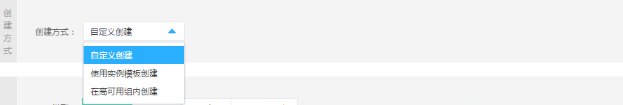
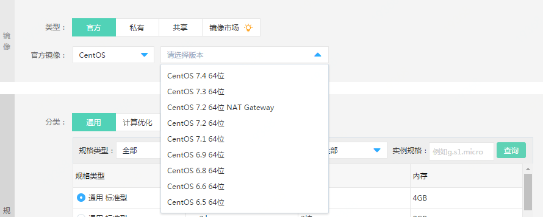
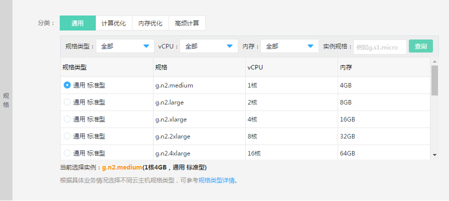
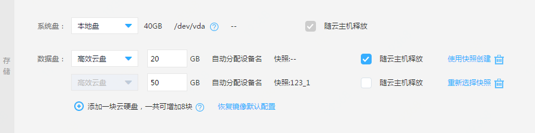
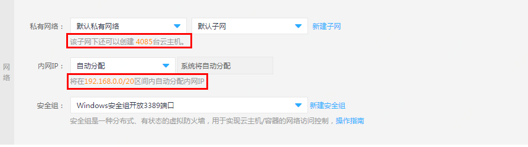
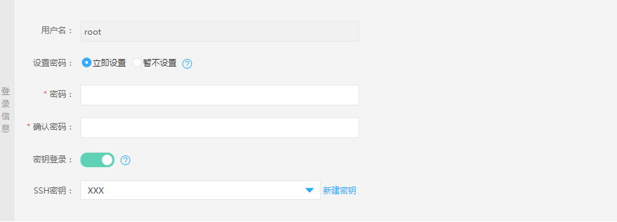

# 创建Linux实例
1. 访问[实例控制台](https://cns-console.jdcloud.com/host/compute/list)，或访问[京东云控制台](https://console.jdcloud.com)点击左侧导航栏【弹性计算】-【云主机】-【实例】进入实例列表页。

2. 选择创建实例所属地域，点击【创建】按钮，进入云主机购买页面。建议您根据业务情况选择实例所在地域，关于京东云地域详细信息，请参见[地域与可用区](../Introduction/Regions-and-AvailabilityZones.md)。

3. 选择计费模式：包年包月和按配置计费，包年包月按一个整月进行购买付费，按配置计费按照实际使用的时长（精确至秒）每小时进行扣费。关于两种计费方式的区别，请参见[计费规则](../Pricing/Billing-Rules.md)。

4. 地域与可用区选择：在此步骤仍可以选择实例对应的地域（华北-北京、华南-广州、华东-宿迁及华东-上海）及可用区，请注意“不同地域资源内网不互通，创建之后不可更改”，如果所选地域限额已满，可以通过[提交工单](https://ticket.jdcloud.com/myorder/submit)提升限额。

5. 创建方式选择：提供三种创建方式 **自定义创建**、**使用实例模板创建**、**在高可用组内创建**，后两种需要您预先创建好实例模板和高可用组，如果是除此使用保持默认选项“自定义创建”即可。

6. 选择镜像：镜像分为云硬盘系统盘镜像及本地盘系统盘镜像，前者仅支持创建系统盘为云硬盘的实例，后者仅支持创建系统盘为本地盘的实例。
	
	此外，每类镜像都分提供以下镜像类型：**官方镜像**、**私有镜像**、**共享镜像**、**镜像市场镜像**四类镜像，详细区分请参见[镜像概述](../Operation-Guide/Image/Image-Overview.md)。
    
    对于初次使用京东云的用户可以选择京东云提供的“官方镜像”，您可以根据需要选择对应的系统，并选择合适的版本。
    
    如果您已经创建好自己的实例，并配置好相应的环境，可以将此实例进行制作私有镜像操作，同时基于此镜像批量创建有相同系统及环境配置的主机，还可以将此私有镜像共享给其他京东云用户。 

7. 选择实例规格：实例的规格支持用户自定义选择，从最小的1核1G（如g.s1.micro）到72C576GB（如m.n2.18xlarge），用户可以根据不同业务场景选择实例规格及相应配置，详细请参见[实例规格](../Introduction/Instance-Type-Family.md)。

8. 配置实例存储：
   * 云主机系统盘：支持本地盘及云硬盘，其中本地盘免费40GB，且容量不可变更。云硬盘支持40GB~500GB。                
   * 云主机数据盘：若系统盘为本地盘则支持挂载8块数据盘，若系统盘为云硬盘则支持挂载7块数据盘。数据盘可选高效云盘和SSD云盘，云硬盘挂载到云主机后，需要进入云主机操作系统挂载云硬盘。     
   
    您可以随实例创建指定类型和容量的空盘，也可以基于已有云硬盘快照创建数据盘。支持按配置计费且非多点挂载云硬盘设置随实例删除属性，若勾选，会在实例删除时一并删除。关于数据盘设备名分配规则请查阅[设备名分配规则](../Operation-Guide/Cloud-Disk/Assign-Device-Name.md)。      
	云硬盘费用与实例独立，具体价格信息请查阅[云硬盘价格](http://docs.jdcloud.com/cn/cloud-disk-service/billing-rules)。

9. 配置实例网络：
   * 选择私有网络及子网：若当前地域未创建可以选择“默认私有网络”和“默认子网”。选择子网后，系统会判断该子网下，还有可以创建的云主机数量，如果暂时没有子网，可以通过快速入口新建子网，并在“云主机网络”进行选择，详细请参见[私有网络](http://docs.jdcloud.com/cn/virtual-private-cloud/product-overview)和[子网](http://docs.jdcloud.com/cn/virtual-private-cloud/subnet-features)。
   * 选择内网IP分配方式：如对内网IP地址没有特殊要求，可以不指定由系统自动在子网可用网段内分配，如需指定请在提示范围内输入，系统会校验IP是否可用。须注意的是，若选择自定义内网IP地址，则无法批量创建实例。
   * 选择安全组：实例在创建时必须绑定一个安全组，若当前地域下未创建自定义安全组，可以在系统创建的三个默认安全组中选择一个绑定（每个私有网络创建成功之后都会自动创建三个默认安全组），也可以通过快速入口前往安全组页面[创建安全组](http://docs.jdcloud.com/cn/virtual-private-cloud/security-group-configuration)。由于官方镜像系统内防火墙默认关闭，建议绑定仅开放22端口（Linux）或3389端口（Windows）的安全组，实例创建之后再根据访问需求创建新的安全组并绑定。    

10. 配置公网带宽：
   * 带宽计费方式：京东云提供按固定带宽和按使用流量两种带宽计费类型的弹性公网IP，按固定带宽计费按购买时设置的带宽上限值付费，而与实际访问公网所用带宽无关，按使用流量计费则根据您实时访问公网的实际流量计费。
   * 线路：弹性公网IP线路分为：BGP和非BGP，若您需要更快更高效的网络接入请选用BGP。                
   * 带宽范围：1Mbps~200Mbps。
在创建主机过程中可以暂不购买公网IP，完成主机创建后，再进行绑定。弹性公网IP带宽费用与实例费用独立。具体价格信息请查阅[弹性公网IP价格](../../../Networking/Elastic-IP/Pricing/Price-Overview.md)。      

11. 设置实例名称、描述：
您需要设置创建的主机名，名称不可为空，只支持中文、数字、大小写字母、英文下划线“ _ ”及中划线“ - ”，且不能超过32字符，如果为批量创建购买，名称以“xxx1”、“xxx2”依次显示。同时支持为实例添加描述，描述允许为空，若添加长度不能超过256字符。

12. 设置密码、密钥：
	对于设置密码，可以选择“立即设置”密码，也可以选择“暂不设置”（系统会以短信和邮件方式发送默认密码），密码除了用于SSH登录实例时的密码，也是控制台通过VNC登录实例的密码。                

	对于Linux系统，可以选择SSH密钥登录，通过绑定已经创建的SSH密钥进行更安全的实例登录认证，详细SSH密钥创建及登录帮助，请查阅 [SSH密钥](../Operation-Guide/Key-Pair/KeyPair-Overview.md)。  

13. 确认云主机数量及购买时长：
	购买数量受限该地域您云主机、云硬盘、公网IP限额以及所选子网剩余IP数量，若限额不够，可通过[提交工单](https://ticket.jdcloud.com/myorder/submit
)提升限额。
	
	若购买包年包月实例，则需要设置购买时长，最短为1个月，最长为3年。若需要更长服务时长请[提交工单](https://ticket.jdcloud.com/myorder/submit
)。

## 相关参考

[地域与可用区](../Introduction/Regions-and-AvailabilityZones.md)

[计费规则](../Pricing/Billing-Rules.md)

[镜像概述](../Operation-Guide/Image/Overview.md)

[实例规格](../Introduction/Instance-Type-Family.md)

[设备名分配规则](../Operation-Guide/Cloud-Disk/Assign-Device-Name.md)

[云硬盘价格](http://docs.jdcloud.com/cn/cloud-disk-service/billing-rules)

[私有网络](http://docs.jdcloud.com/cn/virtual-private-cloud/product-overview)

[子网](http://docs.jdcloud.com/cn/virtual-private-cloud/subnet-features)

[创建安全组](http://docs.jdcloud.com/cn/virtual-private-cloud/security-group-configuration)

[弹性公网IP价格](../../../Networking/Elastic-IP/Pricing/Price-Overview.md)

[SSH密钥](../Operation-Guide/Key-Pair/KeyPair-Overview.md)

