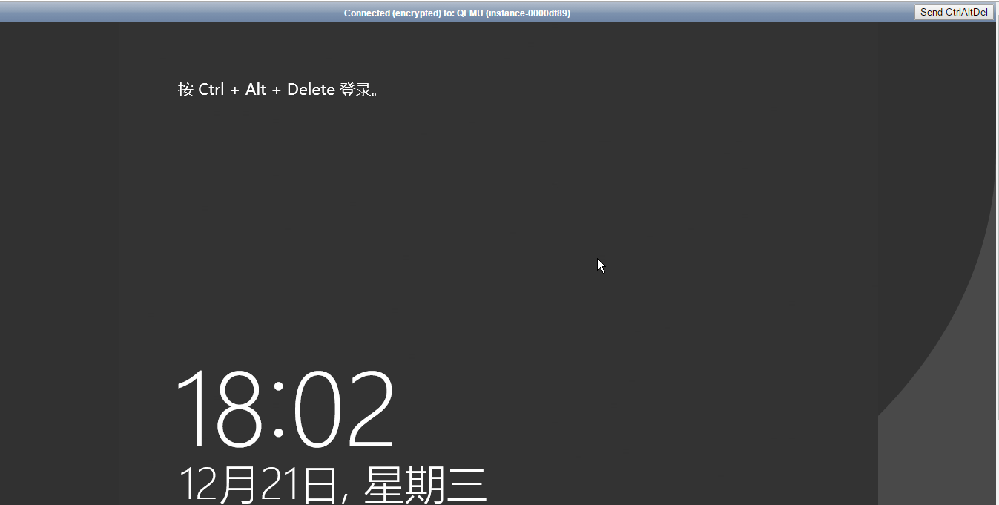
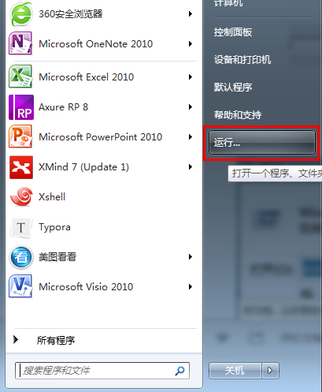
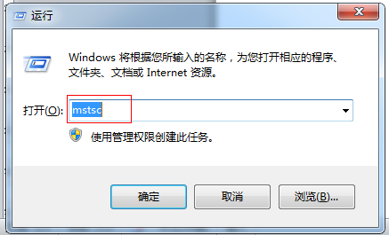
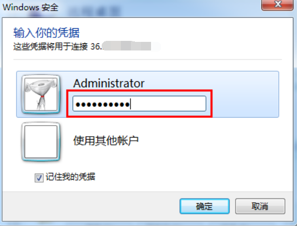
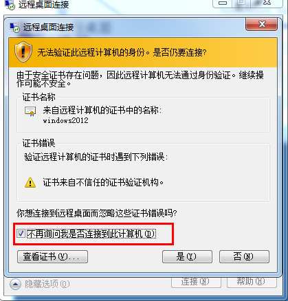
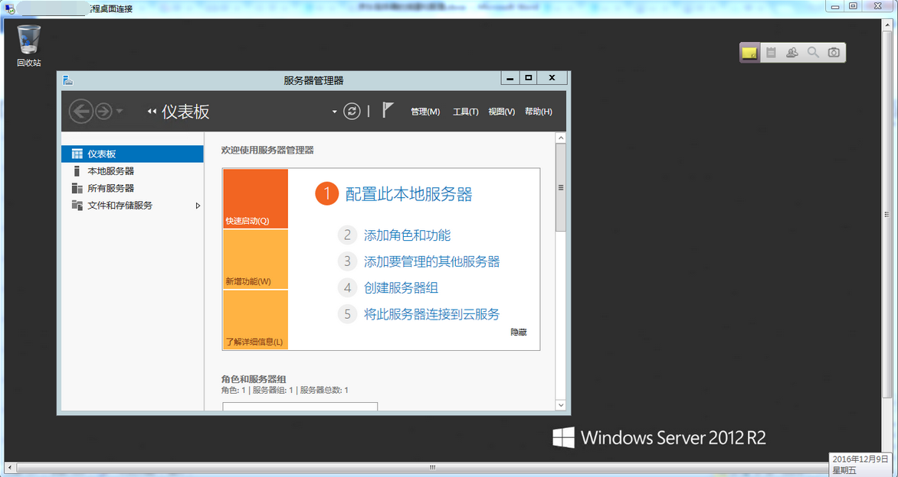

# 登录Windows实例
在购买并启动了Windows类型的实例后，您可以选择登录实例进行相关管理。根据您本地的操作系统和实例是否可被 Internet 访问，不同情况下可以使用不同的登录方式，具体内容可参考下表：

<table>
   <tr>
      <td> 本地操作系统类型 </td>
      <td> Linux实例绑定公网IP  </td>
      <td> Linux实例没有绑定公网IP </td>
   </tr>
   <tr>
      <td> Wndows </td>
      <td> VNC 登录<br>远程桌面连接  </td>
      <td rowspan="3"> VNC登录 </td>
   </tr>
   <tr>     
      <td> Linux </td>
      <td>VNC 登录<br>rdesktop登录   </td>
   </tr>
   <tr>  
      <td> Mac OS    </td>
      <td> VNC 登录<br>rdesktop登录 </td>
   </tr>
</table>

## 登录准备
创建实例并获取账号和对应密码

* 管理员账号：Administrator
* 密码：京东云实例可以通过两种方式获取密码
  *  在创建实例时，选择 【暂不设置 】，则系统将以短信及邮件方式发送默认密码，您可以在登录实例时，使用默认密码进行验证。
  *  选择【立即设置】，则在密码设置文本框中输入自定义密码，如果忘记密码，可以通过[重置密码](../Operation-Guide/Instance/Reset-Password.md)功能重新设置密码，此功能只有“运行”状态实例可用。

## 使用VNC登录实例
VNC登录是京东云为用户提供的一种通过 Web 浏览器远程连接实例的方式。在没有安装远程登陆客户端或者客户端远程登陆无法使用的情况下，用户可以通过 VNC 登陆连接到实例，观察实例状态，并且可通过实例用户进行基本的实例管理操作。
VNC登陆的场景至少包括以下几种：
* 查看实例的启动进度
* 无法通过客户端 SSH 或 mstsc 登录时，通过 VNC 登陆来登录实例

1. 在实例列表的操作列，点击【远程连接】即可通过 VNC 连接至 Windows 实例。


2. 通过在左上角点击 Ctrl+Alt+Del 命令进入系统登录界面：
* 默认用户名：administrator        
* 密码：为您创建实例时设置的实例密码 


请注意：

* 同一浏览器下，同一时间只支持使用VNC登录一台实例。
* 要正常使用VNC登录，建议使用高版本浏览器，如：Chrome，Firefox，IE10及以上版本等。
* 暂不支持复制粘贴。
* 暂不支持文件上传下载。

## 本地为Windows，使用远程桌面登录Windows实例
使用MSTSC 远程桌面连接Window实例，须先确保实例绑定公网IP，并且安全组和网络ACL规则中允许通过此类访问。可在京东云控制台创建Windows系统实例，获得公网IP：XXX.XXX.XXX.XXX
1. 点击电脑【开始】按钮，找到“运行”<br>
<br>
2. 在运行中输入mstsc命令，点击确定，即可打开远程桌面连接对话框。<br>
<br>
3. 根据创建实例时绑定的公网IP，连接实例，输入用户名：Administrator，勾选“允许我保存凭据”。<br>

4. 点击【连接】后，输入密码，连接到实例。<br>

5. 勾选“不再询问我是否连接到此计算机”，点击【是】。<br>

6. 成功连接到您在京东云创建的Windows实例。<br>

7. 如果登录失败，请确认公网IP地址是否输入正确，并查看实例关联[安全组](../Operation-Guide/Security-Group/Overview.md)及所在子网的[网络ACL](../../../Networking/Virtual-Private-Cloud/Introduction/Functions/Network-ACL.md)配置，确认实例是否允许3389端口的入流量。


## 本地为Linux，使用rdesktop登录Windows实例
本地系统为Linux，需要远程登录Window实例时，需要安装相应的远程桌面连接程序，通常使用rdesktop客户端。

登录之前请您查看实例所在[安全组](http://docs.jdcloud.com/cn/virtual-private-cloud/security-group-features)及所在子网的[网络ACL](http://docs.jdcloud.com/cn/virtual-private-cloud/network-acl-features)
配置，确保实例3389端口已开放。在安装了rdesktop之后，运行以下命令登录实例：

```
rdesktop -u administrator -p <实例登录密码> <实例公网IP地址>
```

## 相关参考

[重置密码](../Operation-Guide/Instance/Reset-Password.md)

[安全组](http://docs.jdcloud.com/cn/virtual-private-cloud/security-group-features)

[网络ACL](http://docs.jdcloud.com/cn/virtual-private-cloud/network-acl-features)


  [1]: ./images/Getting-Start-Linux-Connect-console.png "Getting-Start-Linux-Connect-console.png"
  [2]: ./images/Getting-Start-Linux-Connect-Windows-VNC.png "Getting-Start-Linux-Connect-Windows-VNC.png"
  [3]: ./images/Getting-Start-Linux-Connect-Windows-menu.png "Getting-Start-Linux-Connect-Windows-menu.png"
  [4]: ./images/Getting-Start-Linux-Connect-Windows-mstsc.png "Getting-Start-Linux-Connect-Windows-mstsc.png"
  [5]: ./images/Getting-Start-Linux-Connect-Windows-mstsc1.png "Getting-Start-Linux-Connect-Windows-mstsc1.png"
  [6]: ./images/Getting-Start-Linux-Connect-Windows-mstsc2.png "Getting-Start-Linux-Connect-Windows-mstsc2.png"
  [7]: ./images/Getting-Start-Linux-Connect-Windows-mstsc3.png "Getting-Start-Linux-Connect-Windows-mstsc3.png"

  [8]: ./images/Getting-Start-Linux-Connect-Windows-mstsc4.png "Getting-Start-Linux-Connect-Windows-mstsc4.png"