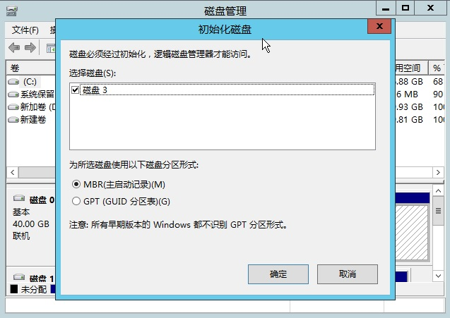
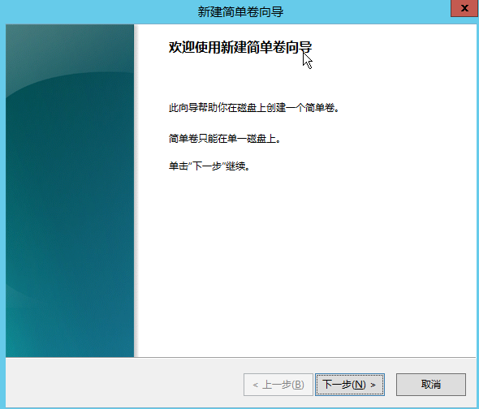
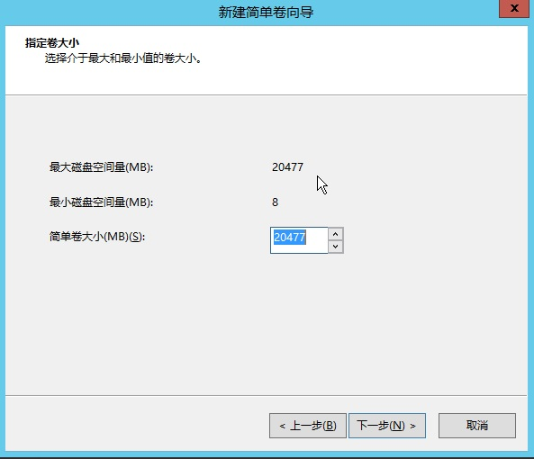
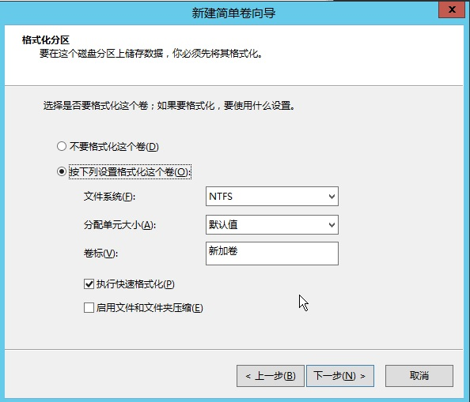
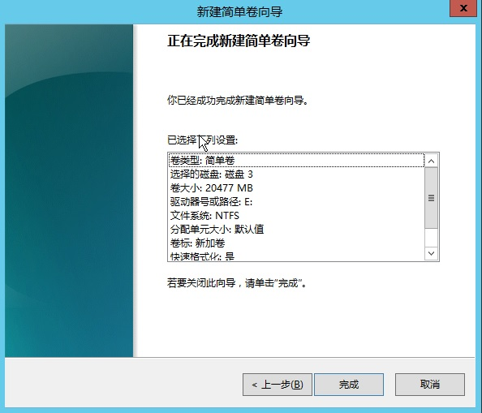

# 创建文件系统
在控制台为Windows实例挂载数据盘之后，需要登录实例对数据盘进行分区、格式化并创建文件系统，之后才可以正常使用数据盘。

下文以Windows Server 2012 R2 标准版操作系统为例，介绍具体操作步骤：

1. 登录Windows实例后，右键点击左下角的【开始】按钮，在弹出的菜单中选择“磁盘管理”，弹出磁盘管理窗口，选择磁盘及对应的分区形式后，单击确定按钮； 

2. 选择未分配的磁盘，右键单击【新建简单卷】； 

3. 在弹出的“新建简单卷向导”弹窗上点击【下一步】； 

4. 指定卷大小； 

5. 设置磁盘驱动器号； 

6. 格式化磁盘分区； 

7. 确认已选配置后，点击【完成】按钮，完成新建卷向导；或点击上一步返回修改已选设置； 

8. 完成以上设置后，即可在“我的电脑”页面查看新添加的云硬盘。 

  [1]: ./images/Getting-Start-Windows-FileSystem-1.png "Getting-Start-Windows-FileSystem-1.png"
  [2]: ./images/Getting-Start-Windows-FileSystem-2.png "Getting-Start-Windows-FileSystem-2.png"
  [3]: ./images/Getting-Start-Windows-FileSystem-3.png "Getting-Start-Windows-FileSystem-3.png"
  [4]: ./images/Getting-Start-Windows-FileSystem-4.png "Getting-Start-Windows-FileSystem-4.png"
  [5]: ./images/Getting-Start-Windows-FileSystem-5.png "Getting-Start-Windows-FileSystem-5.png"
  [6]: ./images/Getting-Start-Windows-FileSystem-6.png "Getting-Start-Windows-FileSystem-6.png"
  [7]: ./images/Getting-Start-Windows-FileSystem-7.png "Getting-Start-Windows-FileSystem-7.png"
  [8]: ./images/Getting-Start-Windows-FileSystem-8.png "Getting-Start-Windows-FileSystem-8.png"