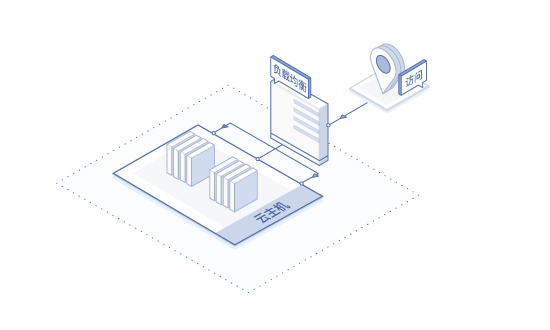
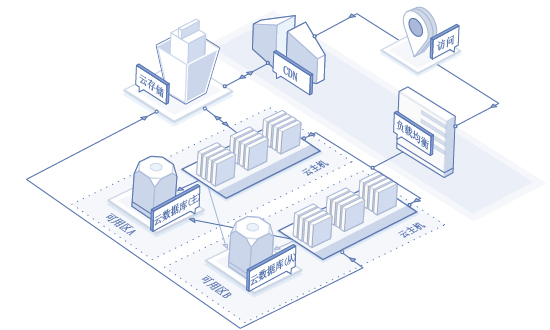

# 应用场景
## 企业网站/Web应用/移动APP
* 场景描述：对于此类应用的初期阶段，访问量通常较小，采用轻量级部署方案，较小实例规格及低带宽的实例配置即可满足业务需求，实现应用程序、数据库等服务的运行。随着网站/应用访问量的增长和服务的多样化，可以快速实现云服务器规格和规模的调整，根据业务周期弹性调整资源配比，以小额成本获得计算能力的弹性提升。
* 建议配置：云主机、负载均衡；实例规格为g.s1.micro（1 核1 GB），弹性公网IP带宽为1 Mbps。

## 海量图片/视频等应用

* 场景描述：在实际的海量图片/视频应用例如大型电商网站中，使用对象存储来存储您的静态图片、视频等数据，并同时使用CDN和负载均衡，可在节约用户成本的同时大幅减少用户访问等待时间。
* 建议配置：云主机、负载均衡、对象存储、CDN、数据库；实例规格为	g.n2.medium（2核4GB），公网IP带宽为5Mbps。

